# 别乱学塔罗了！先搞懂这一个底层逻辑，少走3年弯路

> 整理来源：Luna3Tide 抖音视频 | 字幕来源：Whisper large-v3-turbo
>
> **学习重点**：从塔罗的哲学根源出发，搭建完整知识体系——搞懂底层逻辑，不用死背牌义也能推导出所有牌的含义。

---

## 课程导言：为什么要从底层逻辑学起

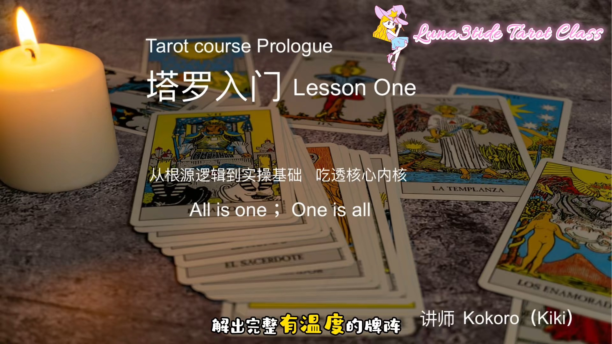

**核心要点**：死背牌义是新手最大的误区，搞懂底层逻辑才能真正入门。

很多刚接触塔罗的朋友都会陷入同一个死胡同：抱着牌义手册死记硬背，78张牌的牌义倒是背得滚瓜烂熟，但真的拿到牌阵解牌的时候，还是脑子一片空白，不知道从哪里下手。甚至会出现单张牌义都懂、合到一起就看不懂的情况。

本节课不想讲枯燥的牌义，而是带大家从塔罗的根源逻辑出发，搭建一套完整的知识体系，吃透最核心的"一切是全，全切是一"的底层逻辑。听完这节课，大家就可以不用死记硬背，也能看懂牌面，解出完整、有温度的牌阵。

今天的课程分为七个核心模块：塔罗的起源与炼金术底层逻辑、塔罗的完整结构、大阿卡纳与小阿卡纳的定位、大阿卡纳的愚人之旅脉络、四元素体系、数字牌与宫廷牌的通用逻辑，以及最终落地实操的解牌方法。

---

## 第一部分：先纠正一个根本误区——塔罗是什么

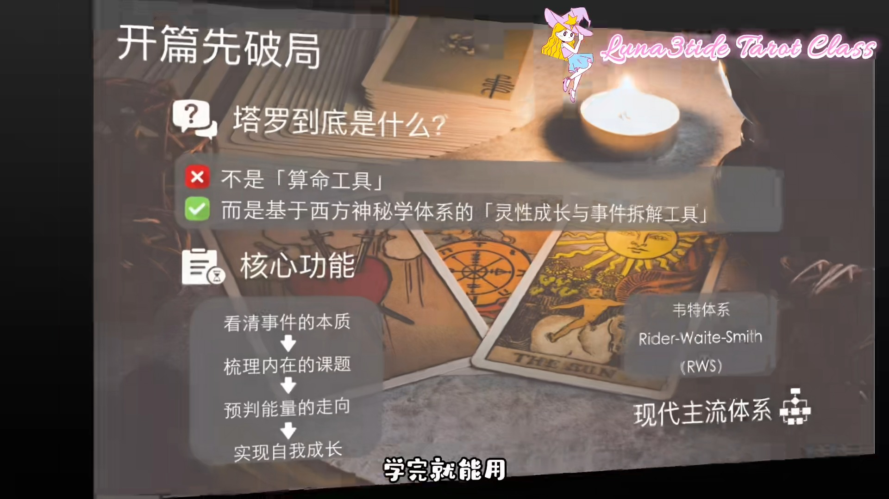

**核心要点**：塔罗不是算命工具，而是帮助我们看清当下、梳理课题、实现自我成长的灵性工具。

很多人觉得塔罗是算命的工具，能预知未来，能算出对方爱不爱我、能不能赚大钱。但塔罗从来都不是预知未来的占卜术，它是一套基于西方神秘学体系的灵性成长与事件拆解工具。也可以把它理解为人类社会多年积累下来的一种"社会统计学"——它的核心功能从来不是说未来一定会发生什么，而是帮我们看清当下事件的本质，梳理内在的课题，预判当下能量的走向，最终帮我们做出最适合自己的选择，实现自我成长。

本节课全程基于全球塔罗教学最通用、最主流的韦特体系，所有术语和牌义都是这套体系的标准内容。

---

## 第二部分：塔罗的起源脉络

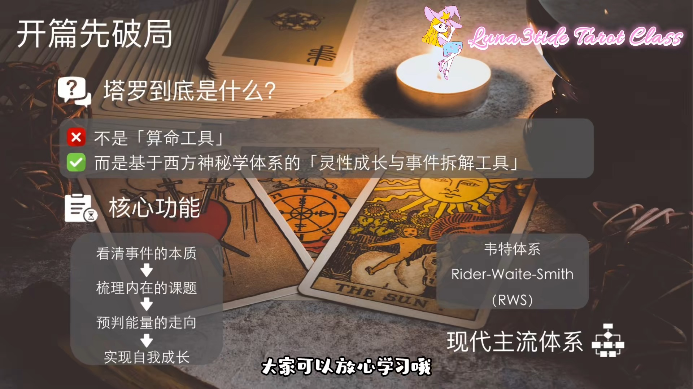

**核心要点**：塔罗经历了三个关键发展阶段，最终在19世纪与卡巴拉、炼金术完成深度绑定，形成现代标准体系。

网上有很多关于塔罗起源的传说，什么源于古埃及、起源于吉普赛人，这些都没有实证，不用纠结。我们只需要学习有完整神秘学体系支撑、能够落地到解读的核心内容。

塔罗的发展核心有三个关键节点。第一是实体雏形阶段，14到15世纪的意大利，塔罗最初只是贵族的卡牌游戏，没有任何神秘学属性，和我们现在玩的扑克牌本质是一样的。第二是体系绑定阶段，18世纪经过法国神秘学者的推动，塔罗才正式被纳入赫尔墨斯主义、卡巴拉、炼金术的西方神秘学体系，成为一套灵性工具。第三是标准定型阶段，19世纪赫尔墨斯黄金黎明协会完成了塔罗与卡巴拉生命之树、四元素核心体系的完整绑定，才正式确立了现代塔罗的标准框架，也就是我们现在学习的这套体系。

---

## 第三部分：整节课的灵魂——炼金术底层逻辑

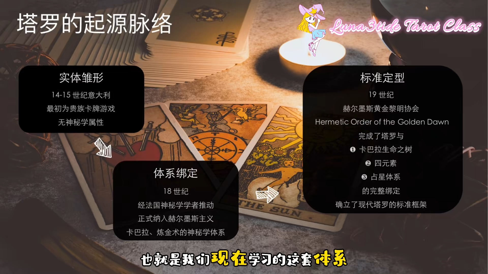

**核心要点**：塔罗与炼金术共享赫尔墨斯主义哲学，"如其在上，如其在下"和"一切是全，全切是一"是理解所有牌义的根本钥匙。

这是整节课最核心的内容，也是学习塔罗这么久最重要的心得，一定要认真理解。搞懂这个底层逻辑，你才算真正入门塔罗，成为一个可以帮别人解牌的塔罗师，而不是只会套牌义的解牌机器。

塔罗和炼金术共享一套核心的底层哲学，也就是赫尔墨斯主义。这里有两个核心法则必须记下来。

第一个核心法则："如其在上，如其在下，如其在内，如其在外。"这句话出自神秘学经典著作《翡翠石板》，意思是宇宙的规律和我们个体的内在规律是完全统一的，外在发生的所有事，都是你内在状态的投射。

第二个核心法则："一切是全，全切是一。"All is one, one is all——世间万物本质都是同源的，任何一个微小的个体都包含着整个宇宙的全部规律。这也是塔罗最核心的逻辑。

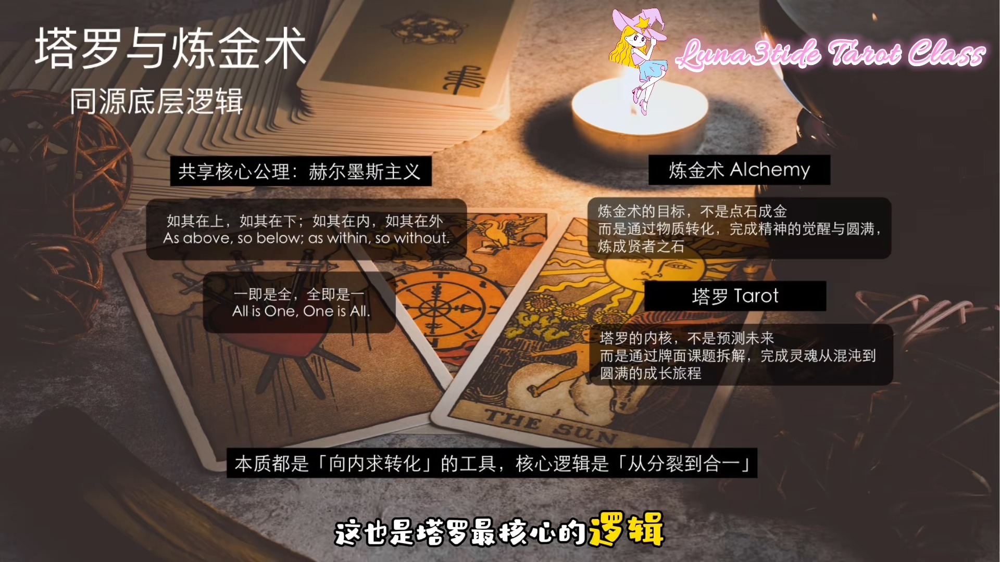

很多人以为炼金术是"点石成金"，把铅变成黄金。但炼金术的终极目标从来都不是炼出物质上的黄金，而是通过物质的转化，完成精神的蜕变与圆满，最终炼成"贤者之石"——让人实现内在的合一与圆满。塔罗也是同样的道理，它不是预测未来的工具，而是通过对当下课题的拆解，完成我们灵魂从混沌到圆满的成长旅程。两者本质上都是向内求、完成转化的工具，都完美切合"从分裂到合一"的核心逻辑，这就是它们深层绑定的根源。

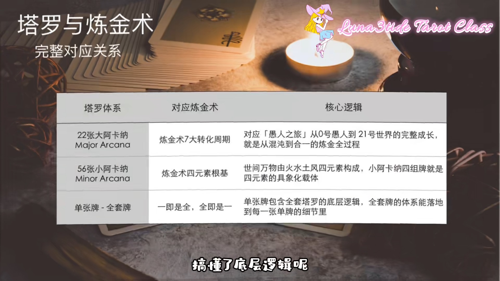

这一部分比较抽象，建议多听几次慢慢消化。每个人对这段核心法则的理解不一定完全一致，就像一千个人心中有一千个哈姆雷特，你只需要理解它的核心逻辑就可以了。

---

## 第四部分：塔罗的完整结构——大阿卡纳与小阿卡纳

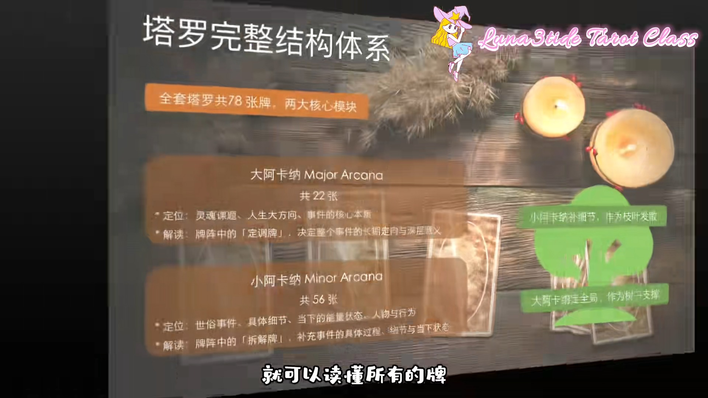

**核心要点**：大阿卡纳是"树干"，定全局课题；小阿卡纳是"枝叶"，补充具体细节——解牌时一定要先看大阿卡纳定调。

全套塔罗牌共78张，分为两大核心板块。

大阿卡纳共22张，核心定位是灵魂课题、人生大方向、事件的核心本质。在解牌时，它是牌阵里的"定调牌"，决定了整个事件的长期走向、深层意义和核心课题。简单说，大阿卡纳会告诉你：这件事本质到底是什么，我们要面对的核心课题是什么。

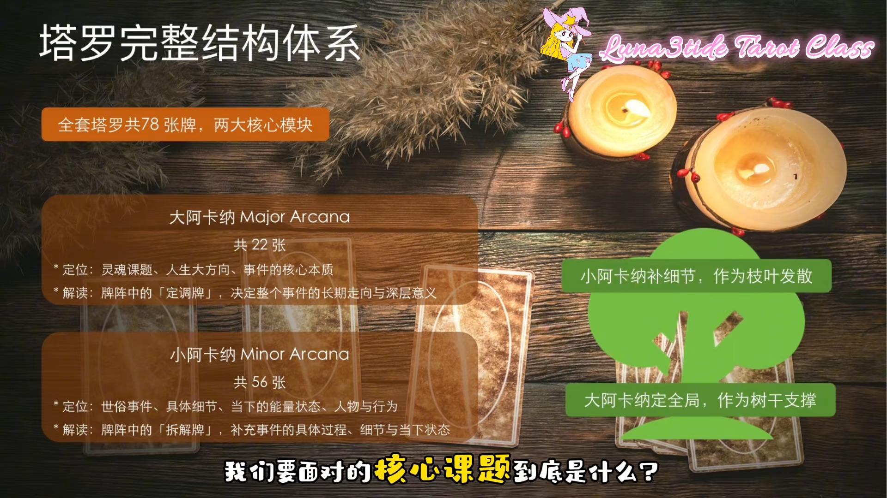

小阿卡纳共56张，核心定位是世俗事件、具体细节、当下的能量状态、人物与行为模式。在解牌时，它是牌阵里的"拆解牌"，用来补充事件的具体过程、细节、人物状态和当下的能量流动。简单说，小阿卡纳告诉我们：这件事具体是怎么发展的，当下是什么状态，有哪些细节。

它们就像一棵树：大阿卡纳是树干，决定了这棵树的长势和方向，定全局；小阿卡纳是枝叶，补充了细节，让这棵树变得更完整。解牌时一定要先看大阿卡纳定调，再看小阿卡纳拆细节，否则很容易陷入细节里，看不清事件的全局。

### 三张牌阵的解读逻辑

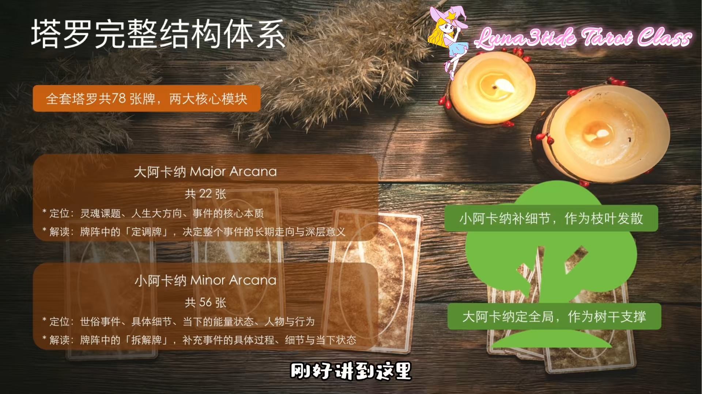

这里顺带说一个常见误区。很多塔罗师在解读三张牌阵时，还是按照从左到右的能量流进行解读，但三张牌阵其实有一套底层逻辑：如果三张里面没有大阿卡纳，以中间的牌作为主牌，左右两张作为辅助牌；一旦出现大阿卡纳，就以大阿卡纳作为主牌，其余两张作为辅助；如果出现两张甚至三张大阿卡纳，则以牌号最大的那张作为主牌，剩下两张作为辅助。

---

## 第五部分：大阿卡纳的核心脉络——愚人之旅

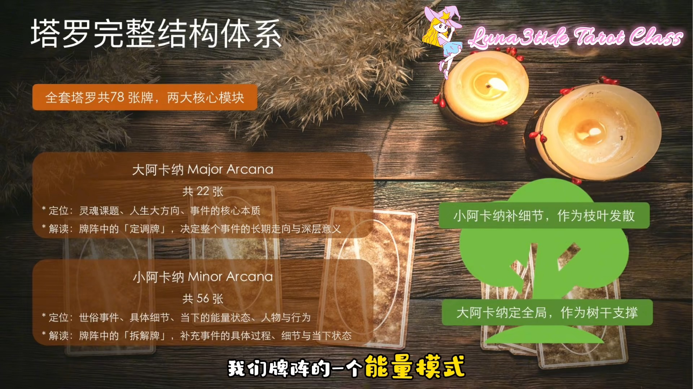

**核心要点**：22张大阿卡纳串联起一个人从懵懂到圆满的完整成长旅程，记住这条成长线，就能推导出每张牌的牌义。

22张大阿卡纳对应着希伯来文的22个字母、卡巴拉生命之树的22条路径，也是我们人生必须经历的22个核心灵魂课题。这22张牌完整串联起一个人从懵懂到觉醒、从混沌到圆满的成长旅程，我们把它叫做"愚人之旅"。

整个愚人之旅分为三大成长阶段，刚好对应炼金术的七大转化周期。

第一阶段是个人觉醒阶段，对应零号到七号牌（愚人、魔术师、女祭司、皇后、皇帝、教皇、恋人、战车），对应炼金术的煅烧、溶解、分离阶段。这个阶段的核心是从懵懂的初始状态慢慢建立个人认知，学会掌控自我，拿到人生的主动权。

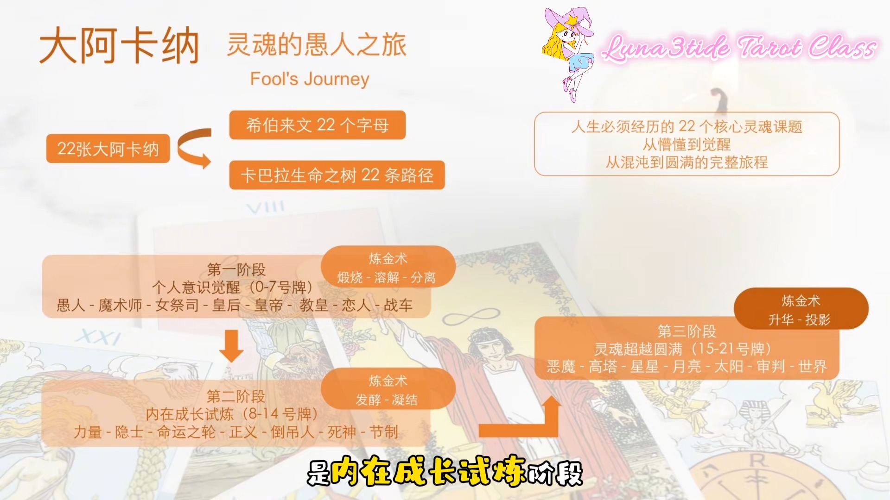

第二阶段是内在成长与疗愈阶段，对应8到14号牌（力量、隐士、命运之轮、正义、倒吊人、死神、节制），对应炼金术的发酵、凝结阶段。这个阶段的核心是学会接纳、放下、平衡，完成内在的疗愈和认知重塑。

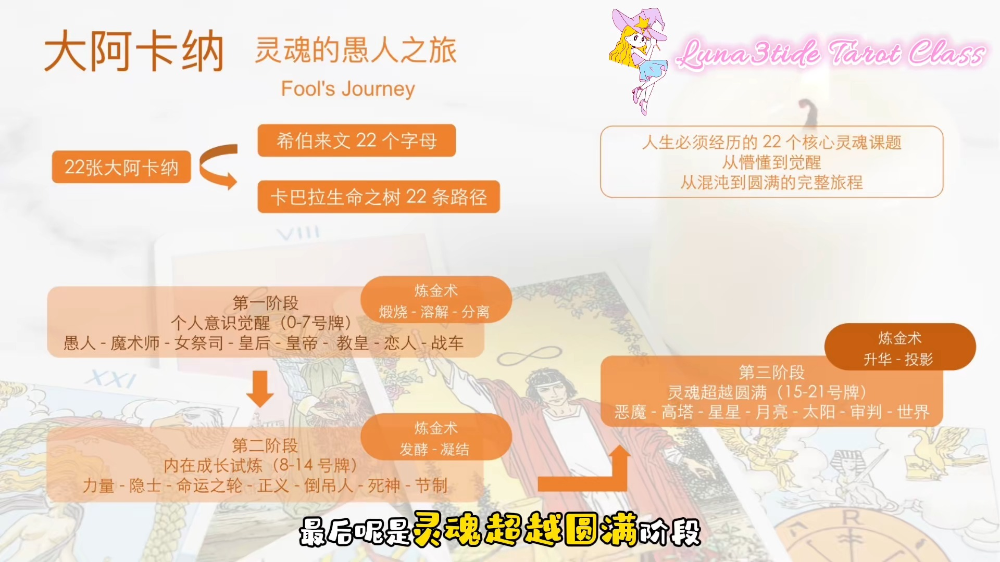

第三阶段是灵魂超越圆满阶段，对应15到21号牌（恶魔、高塔、星星、月亮、太阳、审判、世界），对应炼金术的升华、投影阶段。这个阶段的核心是打破执念的枷锁，经历涅槃重生，最终完成内在的合一，达成灵魂的圆满状态。

不用着急去背每一张牌的牌义，只要记住这条成长脉络，后续每一张牌的牌义都可以顺着这条成长线推导出来，完全不需要死记硬背。

---

## 第六部分：小阿卡纳的根基——四元素体系

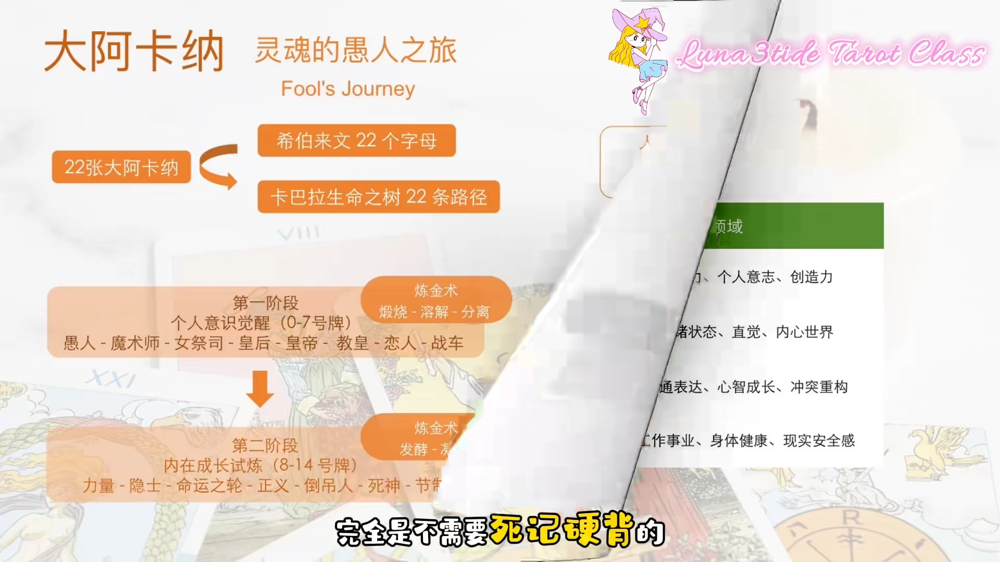

**核心要点**：四元素是小阿卡纳的灵魂，也是塔罗解读的核心钥匙，所有小阿卡纳的牌义都从四元素延伸而来。

小阿卡纳是新手最容易头疼的部分，但只要搞懂它的根基——四元素体系，后面的内容就会变得非常简单。小阿卡纳的所有牌义都是基于四元素体系延伸出来的，四元素就是小阿卡纳的灵魂，也是塔罗解读的核心钥匙。

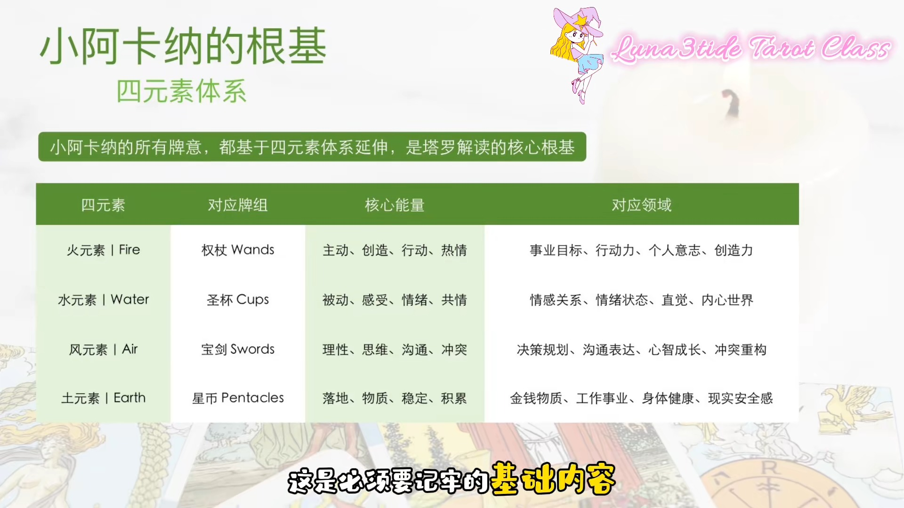

火元素对应权杖牌组，核心能量是主动、创造、行动、热情，对应世俗领域里的事业目标、行动力、个人意志和创造力，是外向的、爆发的驱动力。

水元素对应圣杯牌组，核心能量是被动、感受、情绪、共情，对应世俗领域的情感关系、情绪状态、直觉和内心世界，是内向的、流动的感知力。

风元素对应宝剑牌组，核心能量是理性、思维、沟通、冲突，对应世俗领域的决策规划、沟通表达、心智成长、冲突与重构，是理性思辨的逻辑力。

土元素对应星币牌组，核心能量是落地、物质、稳定、积累，对应世俗领域里的金钱、物质、工作事业、身体健康和现实安全感，是务实沉淀的积累力。

记住这四元素的核心特质，后面的数字牌和宫廷牌，就是"元素 + 数字"或"元素 + 人物特质"的组合，记住这个公式，牌义就可以直接推导出来。

---

## 第七部分：小阿卡纳的一体两面——数字牌与宫廷牌

**核心要点**：数字牌描述事件发展周期，宫廷牌描述人物能量状态，两者都遵循通用逻辑，记住公式就能推导所有牌义。

### 数字牌：元素能量的事件发展周期

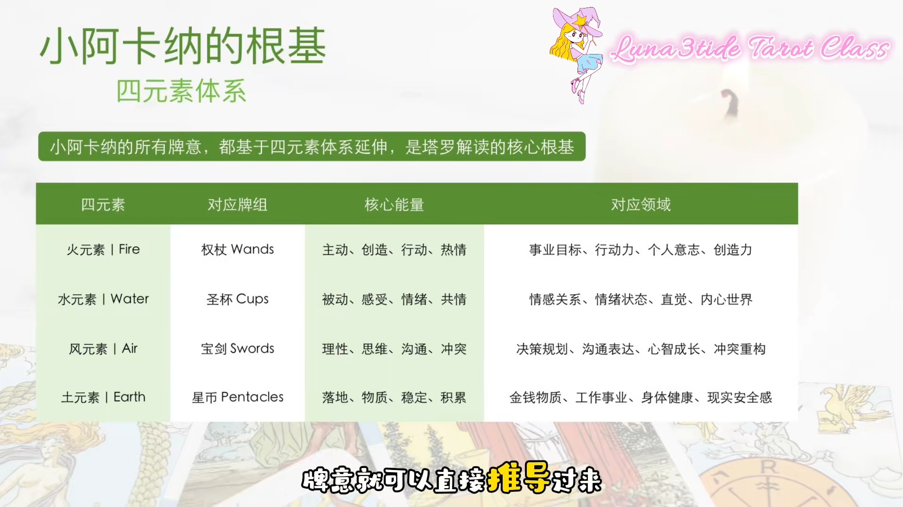

数字牌的核心定位是四元素的事件发展层面，对应着元素能量从诞生到完结的完整生命周期。每组数字牌从Ace首牌到十号牌，都遵循一套百分百通用的逻辑，四组牌完全通用。

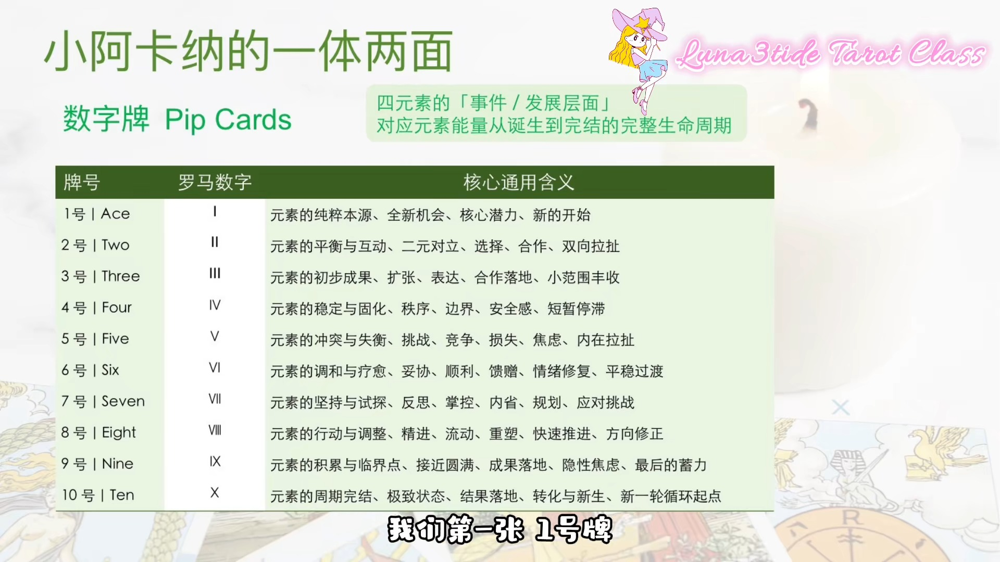

一号牌（Ace）：元素的纯粹本源，全新的机会、核心潜力、新的开始。二号牌：元素的平衡与互动，二元对立、选择、合作、上下拉扯。三号牌：元素的初步成果，扩张、表达、合作落地、小范围丰收。四号牌：稳定与固化，秩序、边界、安全感、短暂的停滞。五号牌：元素的冲突与失衡，挑战、竞争、损失、焦虑、内在拉扯。六号牌：元素的调和与疗愈，妥协、顺利、馈赠、情绪修复、平稳过渡。七号牌：元素的坚持与试探，反思、掌控、内心规划、应对挑战。八号牌：行动与调整，快速流动、快速推进、方向修正。九号牌：积累临界点，圆满成果落地、隐形焦虑、最后的蓄力。十号牌：元素的周期完结，极致状态、结果落地、转化与新生、循环起点。

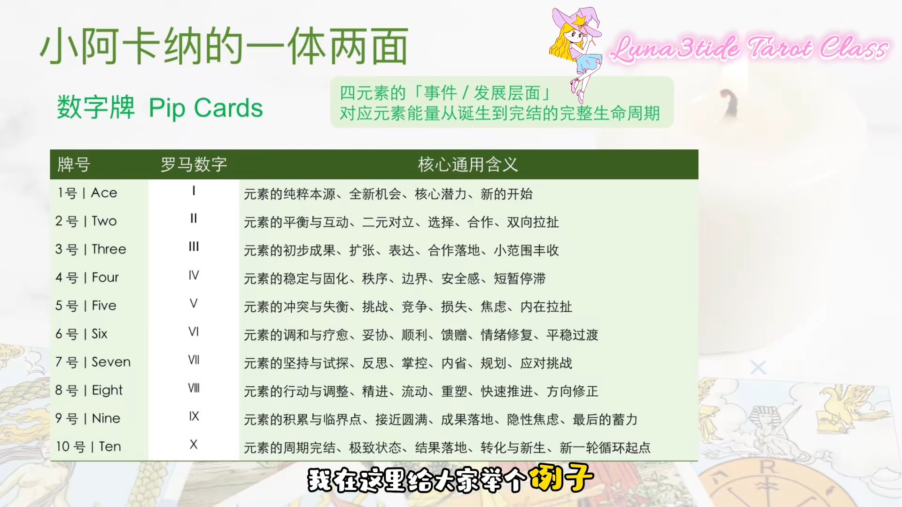

举个例子：问情感发展，抽到圣杯一——圣杯是水元素对应情感，一号是新的开始，推导出来就是情感上会有新的机会、新的桃花，一段新的感情即将开始。再比如问事业，抽到宝剑十——宝剑是风元素对应思维冲突，十号是周期完结，推导出来就是当下的事业困境、职场冲突即将彻底终结，破而后立，迎来新的开始。所有的数字牌都可以用这个逻辑推导出来。

### 宫廷牌：元素能量的人物状态层面

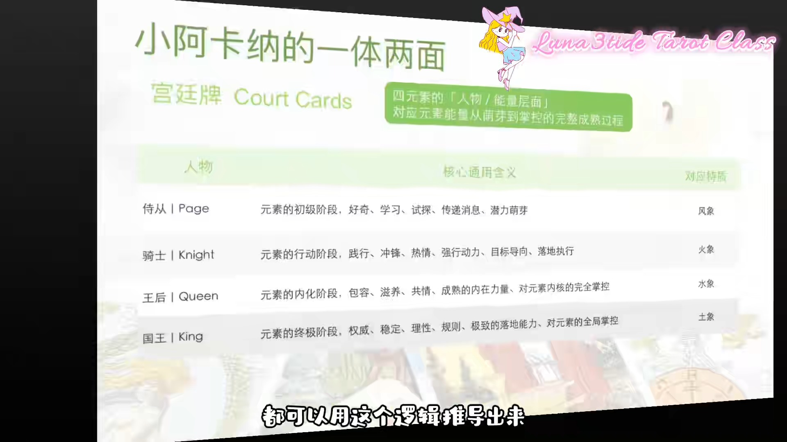

宫廷牌的核心定位是元素的人物能量层面，对应着元素能量从萌芽到掌控的完整成长过程。每组宫廷牌有侍从、骑士、王后、国王四张，同样遵循一套通用逻辑，四组牌完全通用。

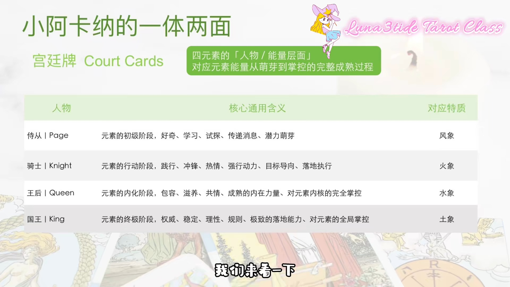

侍从牌是元素的初级阶段，核心特质是好奇、学习、试探、传递消息、潜力萌芽，对应风象特质。骑士牌是元素的行动阶段，核心特质是冲锋、热情、强行动力、目标导向、落地执行，对应火象特质。王后牌是元素的内化阶段，核心特质是包容、滋养、共情、成熟的内在力量、对元素内核的完全掌控，对应水象特质。国王牌是元素的终极阶段，核心特质是权威、稳定、理性、规则、极致的落地能力、对元素全局的掌控，对应土象特质。

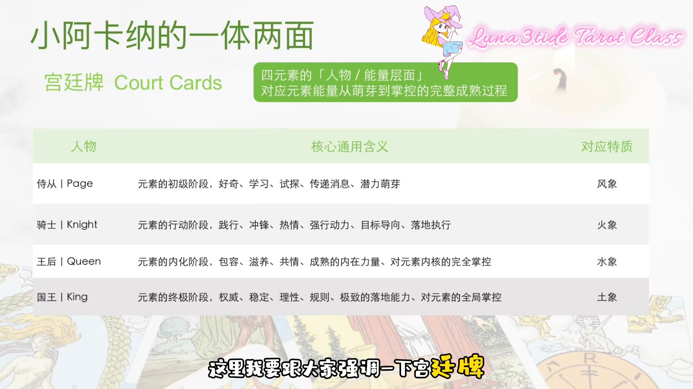

这里要特别强调：宫廷牌不只可以指代现实中的某个人，也可以指代一种性格特质、一种行为模式，甚至是当下的能量状态。比如权杖骑士，它既可以指代一个热情冲动、行动力极强的人，也可以指代当下你自己有极强的行动力、想要冲锋去完成某个目标。解牌时一定要灵活运用，不要把它框死在只能指代某个人或某件行为里。

---

## 第八部分：实操落地——解牌核心方法

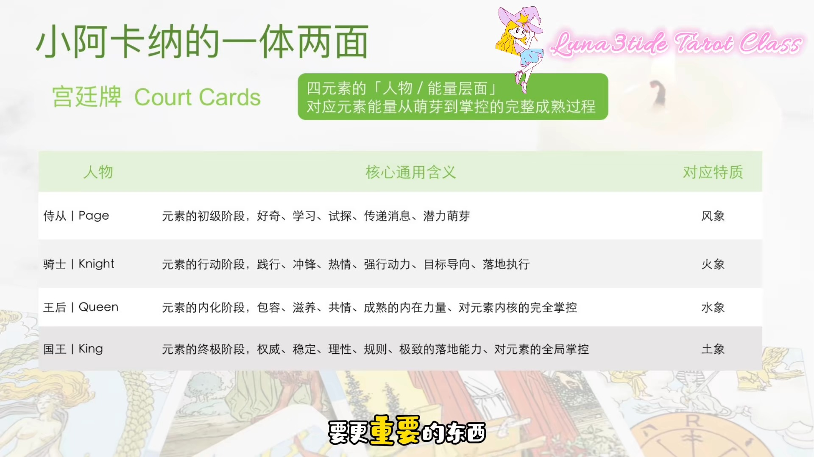

**核心要点**：解牌的核心顺序是"先定调，再拆细节"，用万能公式推导牌义，最终回归整体能量流动。

学完所有理论，最后落到实操。解牌的核心顺序一定要记住：先定调，再拆细节。第一步先看牌阵中的大阿卡纳，明确事件的核心课题、本质与长期走向，先把全局定下来；第二步再去看小阿卡纳，拆解事件的具体过程、人物状态、当下细节与能量流动，补充细节。

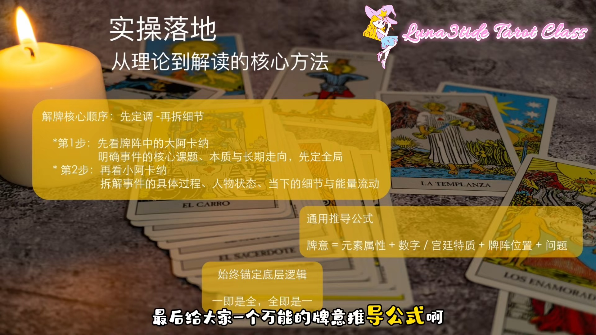

这里给大家一个万能的牌义推导公式：**牌义 = 元素特质 + 数字或宫廷特征 + 牌阵位置 + 问题方向**。

举个例子：问事业发展，抽到权杖三。套公式——火元素对应事业、行动力、目标；三号对应扩张、初步成果、规划未来；结合事业问题，推导出来的核心牌义就是：当下事业已经有了初步的进展，正在规划未来的扩张，有向外发展、拓展新赛道的机会。不用死记硬背，用这个公式就能推导出贴合问题、精准的牌义。

最后还要强调：解牌时一定要锚定最开始讲的底层逻辑——"一切是全，全切是一"。既要看单张牌的细节，也要看整个牌阵的全局课题；不要纠结单张牌的好与坏，要看整个牌阵的能量流动。这才是有温度、有深度的解读，而不是冰冷的牌义堆砌。只有这样，才能真实地看到我们到底应该帮助对方解决的问题在哪里。

---

## 课程总结

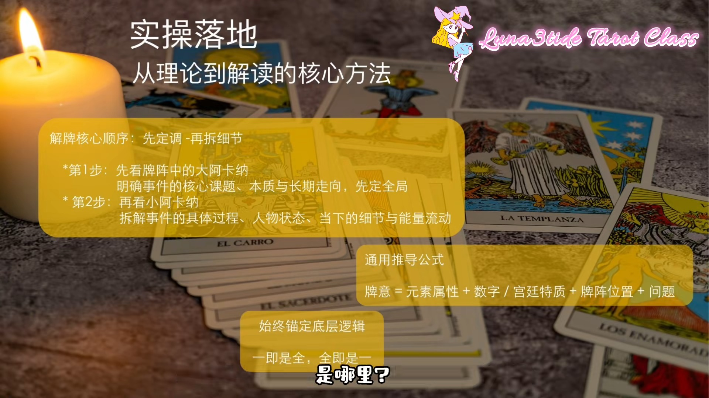

**核心要点**：六个核心模块构成完整塔罗体系，底层逻辑贯穿始终。

本节课核心内容共六点：搞懂了塔罗的底层逻辑——赫尔墨斯主义、"一切是全，全切是一"与炼金术同源；拆解了塔罗完整结构——22张大阿卡纳定全局，56张小阿卡纳拆细节；梳理了大阿卡纳核心脉络——愚人之旅的三大成长阶段，对应灵魂的蜕变与圆满；吃透了小阿卡纳的根基——四元素体系，这是解牌的核心钥匙；掌握了小阿卡纳的一体两面——数字牌和宫廷牌的通用逻辑，不用背牌也能解牌；学到了实操的核心方法——先定调再拆细节，用万能公式推导牌义。

塔罗从来都不是束缚我们的牌义手册，而是帮助我们自我成长、陪伴他人的工具。希望我们都可以在塔罗的体系里，既看清世界，也读懂自己。
