# 10 分钟搞懂西方神秘学整体框架，打通任督二脉

> 整理来源：Luna3Tide 抖音视频 | 字幕来源：Whisper large-v3-turbo
>
> **学习重点**：西方神秘学四大体系（卡巴拉、占星、炼金术、塔罗）并非孤立工具，而是共用同一底层逻辑的完整闭环系统；理解这张"回家地图"，才能真正融会贯通，告别死记硬背牌义。

---

## 神秘学的终极目标：不是预测未来，而是回家

**核心要点**：西方神秘学从诞生第一天起，只有一个终极目标——帮助人的意识从低频的物质世界回归到高频的神圣本源，完成从小我到大我的合一。

学了塔罗很久，还是只会死记硬背牌义，抽了牌也不明白；啃了半天占星，还是只会看星座落宫，搞不懂宫位到底有什么区别——这是很多人的困境。根本原因在于，我们把神秘学当成了预测未来的工具，但这就像拿着一张人生完整的地图，却只盯着脚下的一块石头，彻底浪费了它的核心价值。

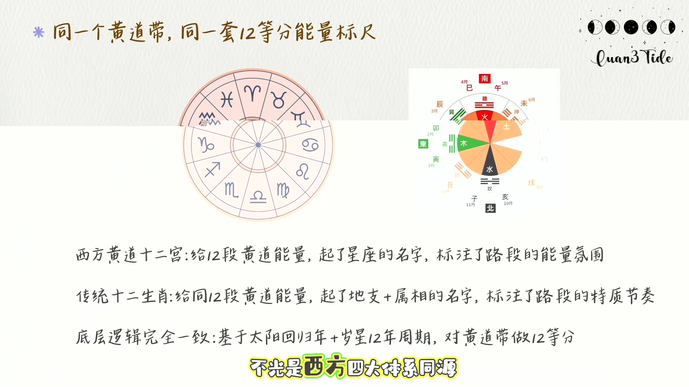

整个西方神秘学体系，说白了就是一场"回家的旅程"。我们每个人都是从"家"（神圣本源）来的，但在物质世界里走得太久，慢慢迷失了方向，忘了自己从哪里来、要到哪里去。神秘学就是一套完整的、帮你走回家的系统。

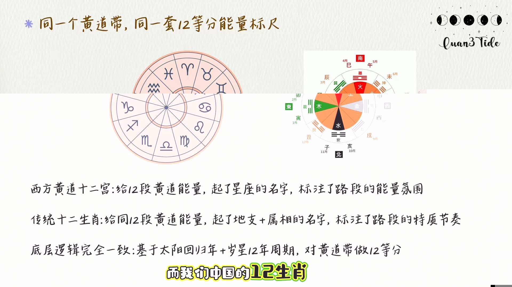

---

## 底层核心法则：如其在上，如其在下

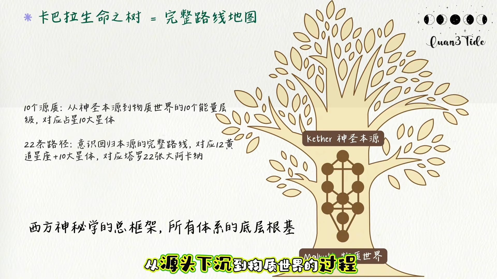

**核心要点**：赫尔墨斯核心法则"如其在上，如其在下，如其在内，如其在外"是整个西方神秘学的哲学基石——宇宙的运行规律与人内心的意识规律完全一致。

这套系统的底层核心，是这句流传了几千年的赫尔墨斯法则："如其在上，如其在下，如其在内，如其在外。"理解起来其实非常简单：宇宙的运行规律和你内心的意识规律完全是一模一样的。天上的黄道带怎么转，你内心的能量就怎么流；宏观的宇宙是一个完整的圆，微观的你也是一个完整的圆。

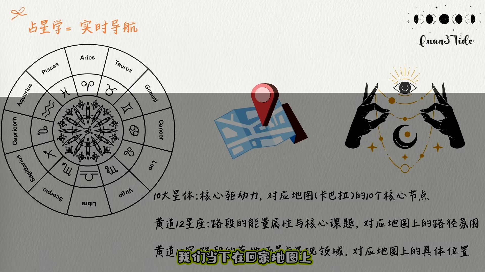

正因如此，整个西方神秘学所有的分支、所有的工具，都是从这同一个源头长出来的，本质上全部都是一回事。

---

## 核心枢纽：黄道十二星座与黄道十二宫

**核心要点**：黄道十二星座描述的是"路段的能量氛围"，黄道十二宫描述的是"路段的具体场景"，二者一体两面，是卡巴拉、占星、炼金术、塔罗四大体系共用的同一套标尺。

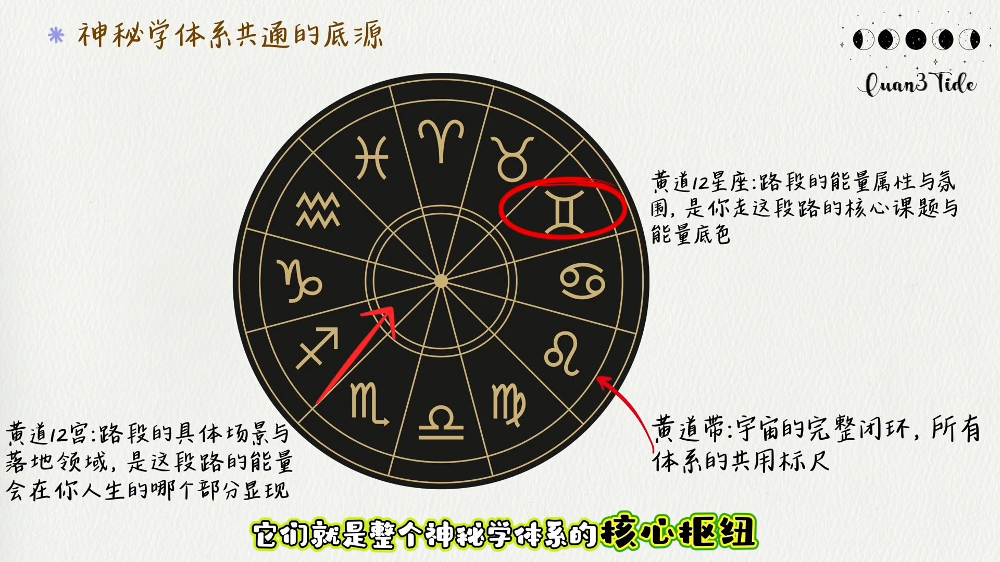

在拆解四大体系之前，需要先搞清楚一个最核心的点。太阳在天上一年走过的完整轨迹就是黄道带，它是一个完美的360度圆，平均分成十二等份，每份三十度，就是黄道十二星座，也对应着黄道十二宫。

很多新手搞不懂二者的区别，其实特别简单：黄道十二星座是你走的这段路的能量属性和氛围，比如白羊座路段就是开拓、勇敢、全新的开始；而黄道十二宫是这段路具体的场景和落地领域，比如第一宫是自我认知的领域，第七宫是亲密关系。二者一体两面，不可分割，共同构成了回家路上的完整路线。

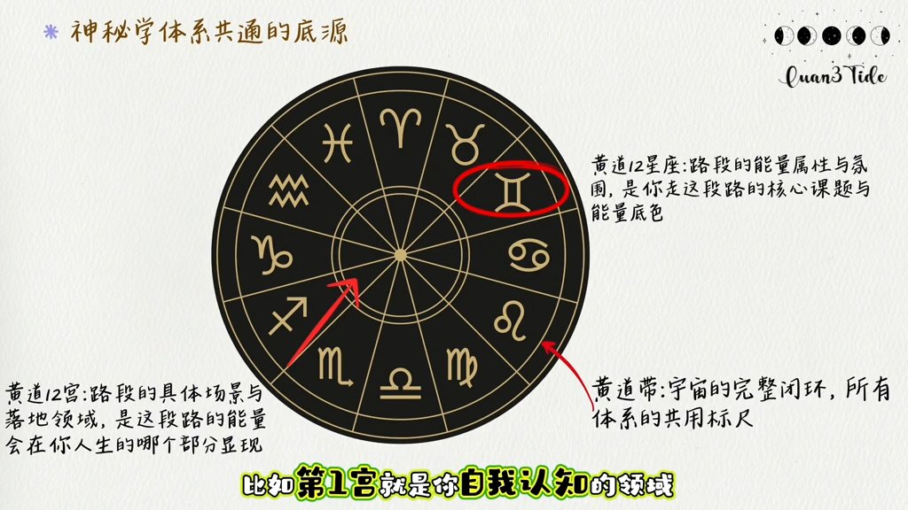

更重要的是，这个完整的黄道带是卡巴拉、占星、炼金术、塔罗共用的一套标尺：十二星座对应卡巴拉的十二条核心路径，也对应塔罗的十二张核心大牌，对应炼金术的十二个转化阶段。这就是为什么说整个神秘学从根上其实就是一回事。

---

## 延伸视角：东西方神秘学同源

**核心要点**：中国的十二生肖与西方的黄道十二宫，本质上是中西方古人望着同一片天空、对同一个360度黄道带的不同命名方式，底层划分逻辑完全一致。

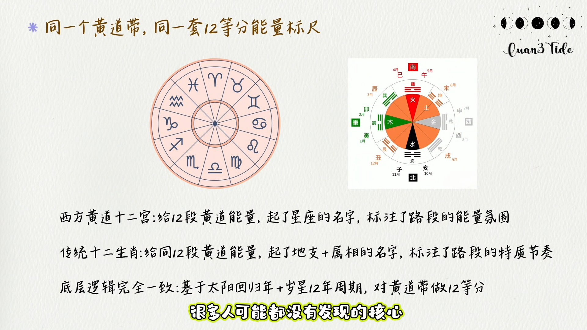

不光是西方四大体系同源，就连东方的十二生肖、十二天干、十二地支，本质上也都是一回事。很多人觉得生肖是中国的，星座是西方的，两者没有关系，但其实中西方的古人是望着同一片天空，观测着同一个太阳和星辰的运行，不约而同地把同一个360度的黄道带分成了十二等份。

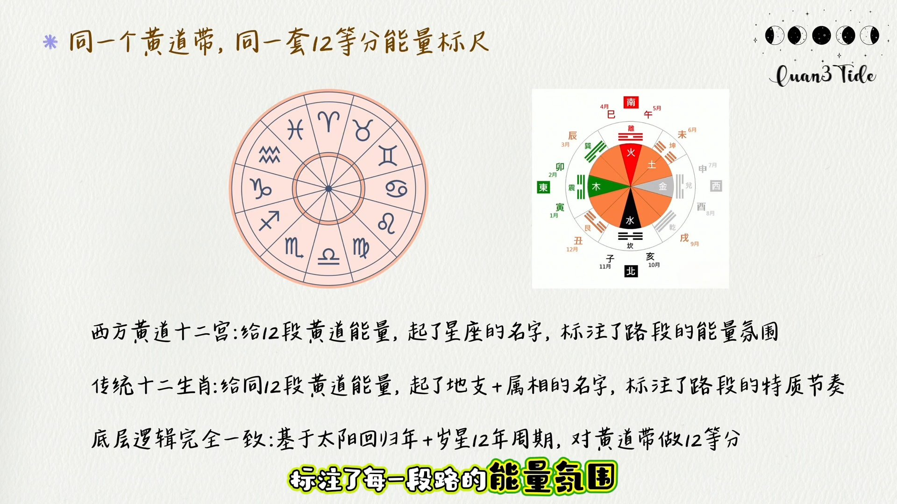

西方的黄道十二宫给这十二段路起了星座的名字，标注了每一段路的能量氛围；中国的十二生肖绑定了十二地支，给这十二段路起了属相的名字，标注了每一段路的特质节奏。就像同一条回家的路，在国内是中文路牌，在国外是英文路牌，路永远是同一条路，能量也永远是同一种能量。

---

## 第一大工具：卡巴拉生命之树——完整的地图

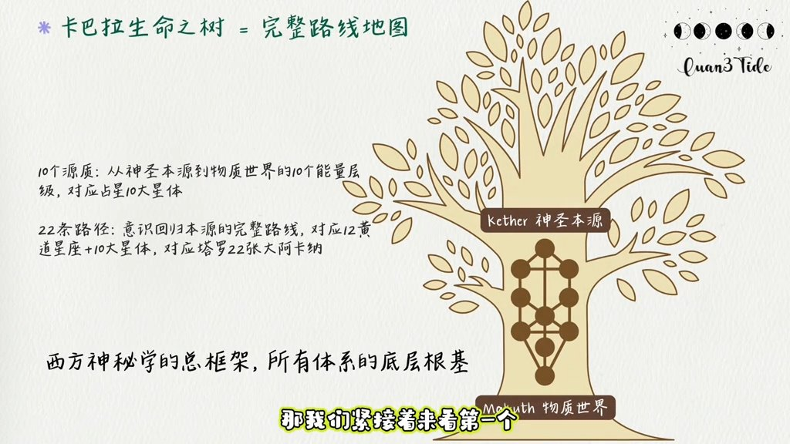

**核心要点**：卡巴拉生命之树是整个西方神秘学的总框架，是一张1:1还原"如其在上，如其在下"的完整导航地图，描绘了从神圣本源到物质世界的十个能量层级和二十二条路径。

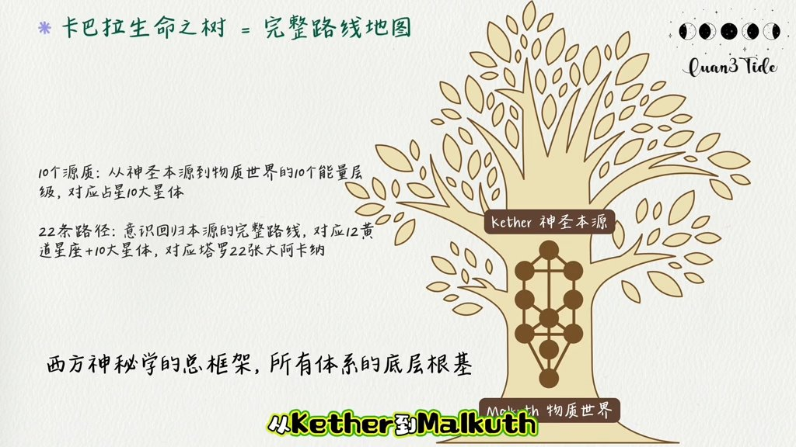

很多人觉得卡巴拉很玄，就是一个画着十个圆圈、二十二条线的符号。其实它是一张完整的导航地图，十个圆圈叫做"质点"（Sephirot），对应着从神圣本源到物质世界十个完整的能量层级。从最顶端的凯瑟（Kether，神圣本源，也就是我们的"家"），到最底端的玛尔库特（Malkuth，我们所在的物质世界）——从凯瑟到玛尔库特，是神圣能量从源头下沉到物质世界的过程，也就是我们"从家出来、来到这个世界"的过程；从玛尔库特回到凯瑟，就是这场回家旅行的完整路线，也是意识提升、自我成长的完整路径。

这张地图是整个西方神秘学的总框架，后面所有的工具都是在这张地图上运行的。没有这张地图，我们学的所有东西都是无本之木、无源之水。

---

## 第二大工具：占星——实时导航与路况报告

**核心要点**：占星学的本质不是预测何时谈恋爱、何时赚钱，而是通过天体的实时运行，帮我们定位当下在"回家地图"上走到了哪个位置，以及现在需要修的课题是什么。

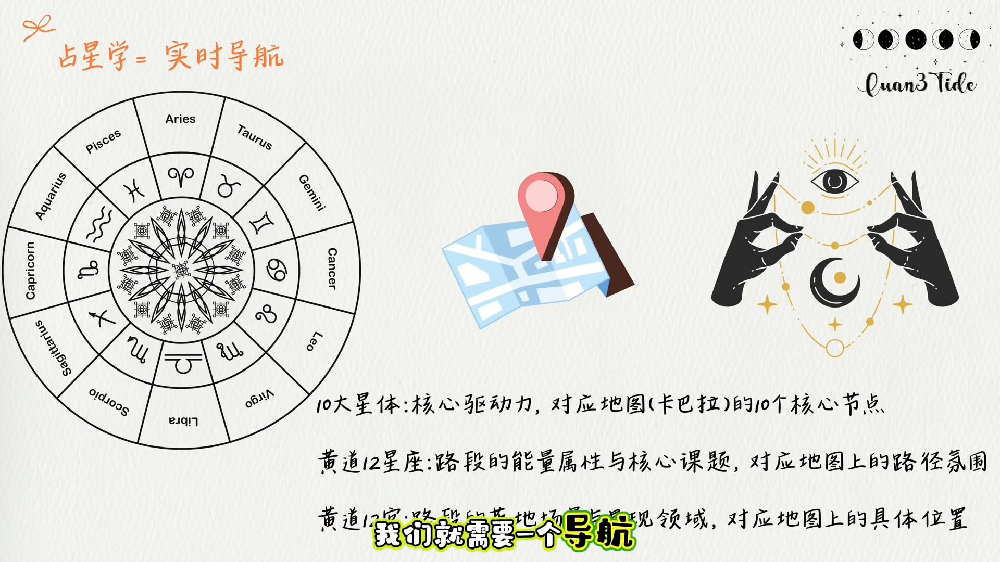

有了地图，接下来需要的就是导航。占星学就是这场旅途的实时导航和路况报告，告诉你当下在哪里、要往哪个方向走、路上有什么要注意。天上的十大星体刚好对应生命之树的十个质点，黄道十二星座也刚好对应生命之树的核心路径，整个黄道带就是能量从源头下沉到物质世界的完整通道。

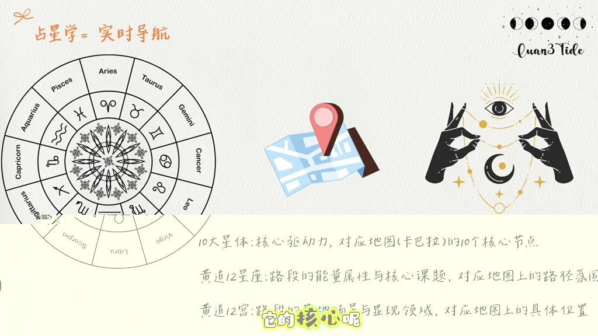

所以占星学的核心，是通过天上天体的实时运行，帮我们定位当下在回家地图上走到了哪个位置，我们当下的意识状态对应着哪个星体的能量，现在有必要修的课题是什么，哪些路口需要减速，哪些路段需要加速——就像实时导航一样，帮我们校准方向，不会走偏，不会迷路。

---

## 第三大工具：炼金术——内在转化的指导手册

**核心要点**：炼金术的真正含义不是点石成金，而是将内在低频的"铅"（小我执念、恐惧、限制性信念）转化为高频的"金"（高我智慧、合一状态），是沿着生命之树地图完成意识升华的操作手册。

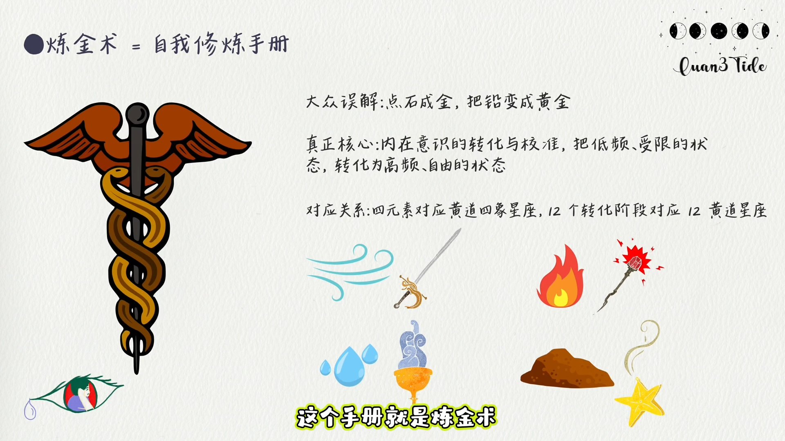

有了地图、有了导航，还需要一本指导手册——告诉你怎么处理路上的故障，怎么顺利抵达目的地。这本手册就是炼金术。很多人对炼金术的误解是"点石成金"，把铅变成金子，但真正的炼金术从来都不是改变外在的物质，而是转化内在的意识。这里的"铅"是我们低频的物质意识，是小我执念、恐惧、焦虑、限制性信念；这里的"金"是我们高频的神圣意识，是高我智慧、合一的状态。

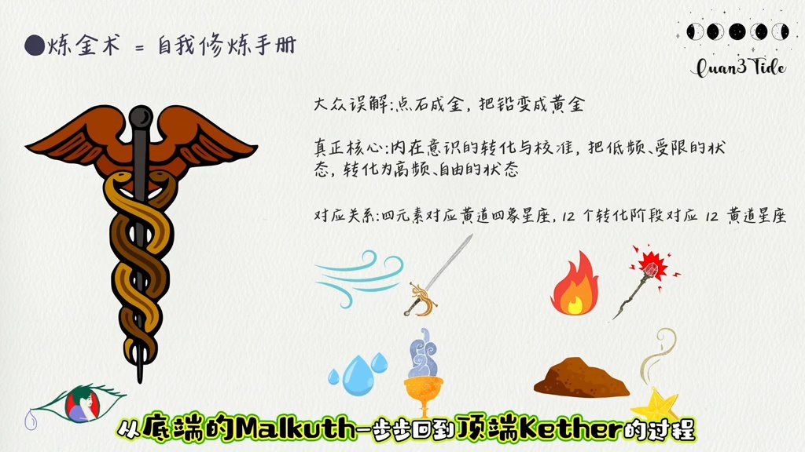

炼金术的整个转化过程，就是沿着生命之树地图，从底端的玛尔库特一步步回到顶端凯瑟的过程，也是把内在的铅一点点炼成金的过程。它会教我们在不同路段怎么换挡、怎么加油、怎么处理刹车故障，怎么整合内在能量、转化负面情绪、突破成长瓶颈。我们在占星导航里看到的课题，在生命之树地图里要走的路径，最终都要靠炼金术的方法一步一步落实、完成转化。

---

## 第四大工具：塔罗——沿途的路牌与指引

**核心要点**：78张塔罗牌中核心的22张大阿卡纳，刚好对应生命之树的22条路径、炼金术的22个意识转化阶段，以及占星的12星座加10大星体——每一张牌都是回家路上的一个站点和路牌。

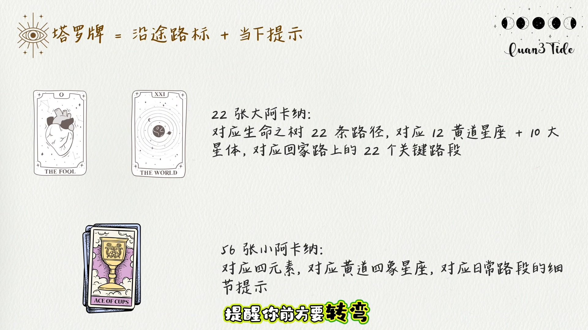

有了地图、导航、指导手册，路上还需要清晰的路线指引牌——提醒你前方要转弯、限速休息，在遇到岔路口时给你明确的指引。这个路牌就是塔罗牌。78张塔罗牌里，核心的22张大阿卡纳刚好对应生命之树的22条路径、炼金术的22个意识转化阶段，以及占星里的12星座加上10大星体。每一张塔罗都是我们回家路上的一个站点、一个路牌，告诉我们当下这个路段是什么样的路况、要注意什么，面临的岔路口该选择哪一条更顺，当下的能量状态是否需要调整。

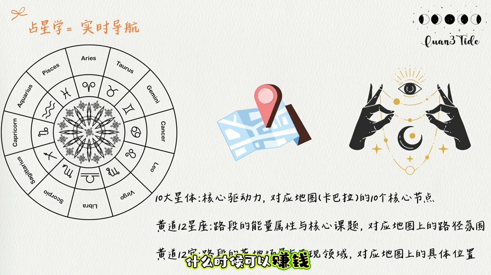

很多人学塔罗只会死记硬背牌义，就是因为不知道这张牌在整个地图里处于哪个位置，对应哪一个导航点，要完成哪个转化步骤。我们永远只看到了一个路牌，却没有拿到整张地图，自然搞不懂它到底想表达什么。当我们把塔罗、生命之树、占星、炼金术串起来的时候，根本不需要死记硬背，看一眼牌就知道它在告诉你什么——这就是打通任督二脉的感觉。

---

## 总结：四大体系的完整闭环

**核心要点**：神秘学的核心从来不是"术"的层面的技法，而是对"道"的层面底层逻辑的理解——先看懂这张完整地图，再去使用工具，所有内容自然融会贯通。

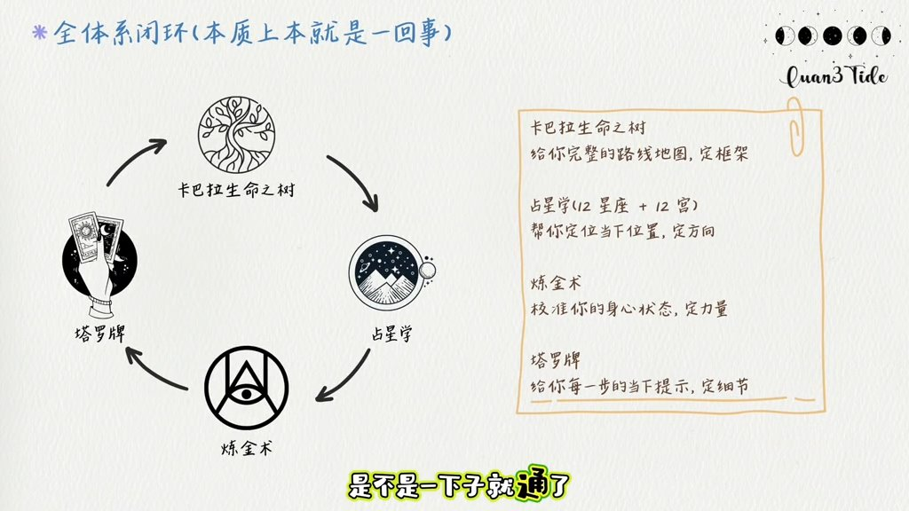

整个西方神秘学体系，不是一堆零散的、玄之又玄的符号和规则，而是一套完整闭环、帮助意识成长的工具体系：卡巴拉生命之树是回家的完整地图路线，告诉你要去哪、有哪些路可以走；占星是实时导航，告诉我们当下在哪里、要走哪个方向、有什么课题需要修；炼金术是指导手册，教你怎么完成内在的转化、顺利抵达目的地；塔罗是沿途的路牌，在迷茫困惑、遇到岔路口的时候给我们当下最精准的指引。

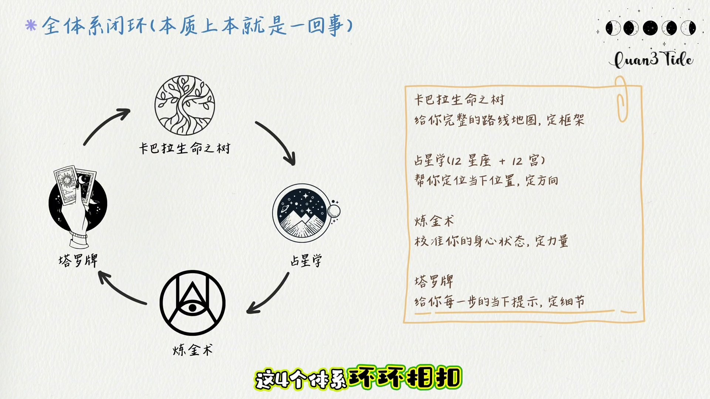

这四个体系环环相扣、互为表里，共用同一个核心底层，指向同一个中心目标。真正的神秘学从业者都能把它们串起来用，因为他们看懂了这张完整的地图，而不是只盯着手里的一个路牌。很多人学了很久还是觉得零散、学不懂，就是因为只学了一个个孤立的工具，却没有搞懂它们的底层逻辑——就像拿着一堆汽车零件，却不知道怎么把它拼成一辆能开的车。

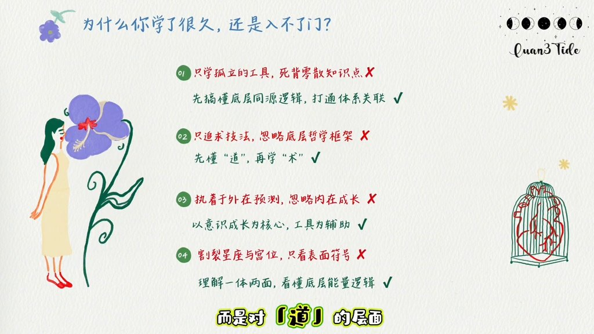

神秘学的核心，从来都不是"术"的层面的技法，而是对"道"的层面底层逻辑的了解。先看懂这张完整地图，再去使用你的工具，你会发现所有的内容都能融会贯通，再也不用死记硬背。
