# 塔罗的灵魂——四元素详解，学会这个牌义不用背

> 整理来源：Luna3Tide 抖音视频 | 字幕来源：Whisper large-v3-turbo
>
> **学习重点**：从底层逻辑彻底厘清塔罗四元素与五行体系的本质区别，掌握元素生克的能量流动规则，直接落地到牌阵解读实战中，一套逻辑通吃78张牌。

---

## 一、课程概览与核心目标

**核心要点**：本课从底层逻辑出发，系统拆解塔罗四元素体系，彻底解决概念混淆问题。

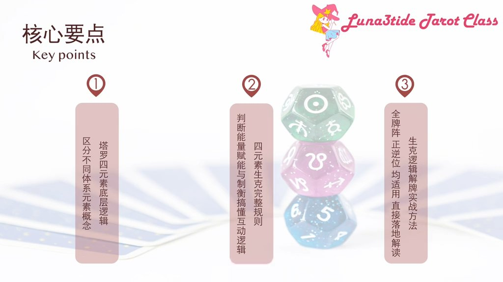

本节课围绕三个核心内容展开。第一，塔罗四元素的底层逻辑——彻底区分不同体系的元素概念，从根源解决"塔罗元素"与"五行"混用的问题。第二，四元素生克的完整规则——精准判断能量的补能与制衡，理解元素间的互动逻辑。第三，元素生克的解牌实战方法——因为全牌阵全适用，可以直接落地到日常解读当中。

---

## 二、塔罗四元素的底层定义

**核心要点**：塔罗四元素是意识能量从灵感到显化的完整流动闭环，与五行体系有本质区别，不可混用。

塔罗体系中的四元素，核心是意识能量从灵感到显化的完整流动闭环，分为火、水、风、土四个阶段，共同构成从概念到结果的完整能量路径。

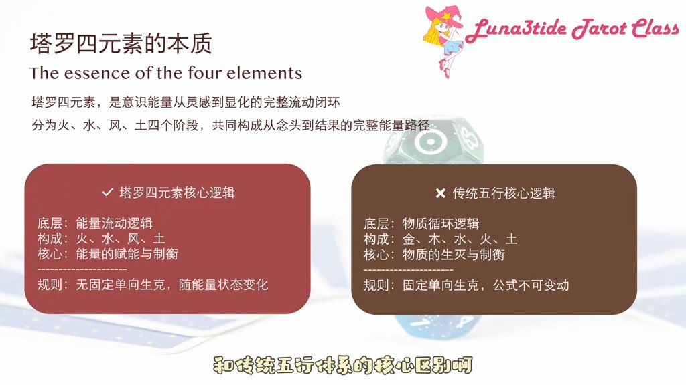

这里必须明确塔罗四元素与传统五行体系的核心区别，这是绝大多数人出现概念混乱的根源。塔罗四元素的核心是能量流动逻辑，没有固定的单向生克；核心作用是能量的补能与制衡。而传统五行体系的核心是物质循环逻辑，有固定的单向生克规则。两个体系的底层逻辑完全不同。同时，塔罗四元素体系中没有"金""木"两个独立元素，因此不可以直接套用五行的生克公式——这是所有概念混乱的起点。

---

## 三、四个元素的精准定义与能量属性

**核心要点**：四元素按火→水→风→土的固定顺序流动，构成从启动到显化的完整能量闭环。

四个元素各有其精准定义与能量属性，这是理解生克关系的基础。

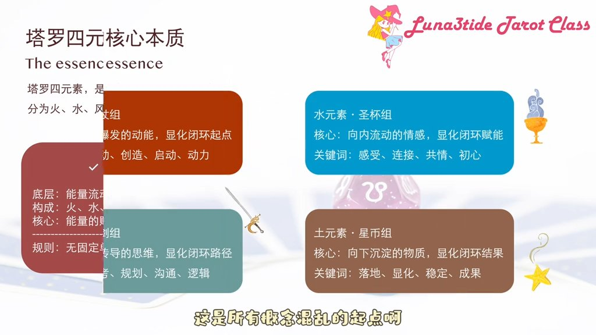

**火元素**：主动爆发的动能，是显化闭环的起点，对应塔罗中的权杖组，核心是行动与创造。

**水元素**：向内流动的情感，是显化闭环的赋能环节，对应塔罗中的圣杯组，核心是感受与连接。

**风元素**：双向传导的思维，是显化闭环的路径规划环节，对应塔罗中的宝剑组，核心是思考与规划。

**土元素**：向下沉淀的物质，是显化闭环的最终结果，对应塔罗中的星币组，核心是落地与显化。

四个元素的流动顺序是固定的：从火的启动，到水的赋能，到风的规划，再到土的显化，构成完整的能量闭环。所有的生克关系都基于这个闭环展开。

---

## 四、生克核心规则：相生与相克的本质

**核心要点**：塔罗中的相生是能量的正向补能，相克是失衡状态下的校准制衡，两者均无固定吉凶之分。

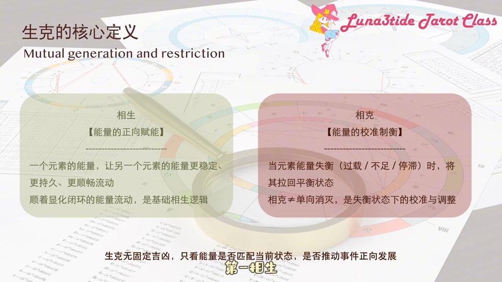

**相生**，指的是能量的正向补能——一个元素的能量能让另一个元素的能量更稳定、更持久、更顺畅地流动。顺着显化闭环的能量流动方向，就是最基础的相生逻辑。

**相克**，指的是能量的校准制衡——当一个元素的能量出现失衡（无论是过载、不足还是停滞），另一个元素的能量能把它拉回平衡状态。这里的相克并不是单向的消灭，不是谁把谁毁掉，而是失衡状态下的校准，是让能量回归正常流动的调整。

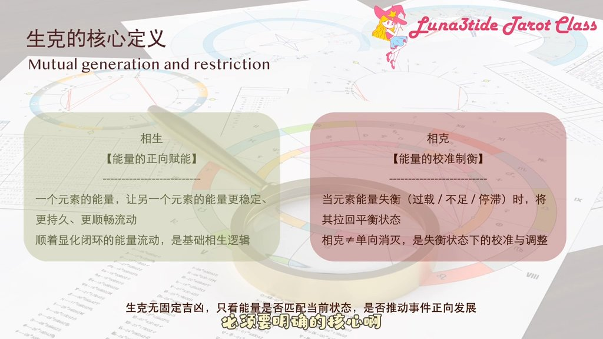

必须明确的核心是：塔罗中的生克没有固定的吉凶之分。相生不一定是好事，相克也不一定是坏事，只看能量是否匹配客户当前状态，能否推动事件向正向发展。

---

## 五、四组相生关系详解

**核心要点**：四组相生关系沿显化闭环依次推进，每组都有明确的能量流动路径与对应牌例。

**第一组：火生风（行动催升思考）**

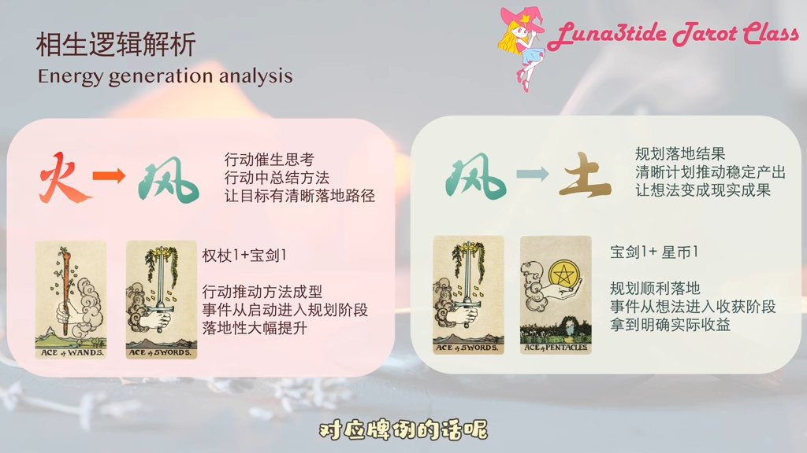

在行动的过程中，会自然形成对应的方法与规划，让原本的目标有更清晰的落地路径。对应牌例是权杖A搭配宝剑A——解牌中出现这个组合，代表客户的行动会推动其找到更清晰的方法，事件会从盲目启动进入到有规划、有路径的阶段，落地性大大提升。

**第二组：风生土（规划落地结果）**

清晰完整的计划，会推动稳定的产出，让原本的想法最终变成实实在在的现实结果。对应牌例是宝剑A搭配星币A——解牌中出现这个组合，代表客户的规划会顺利落地，拿到对应的实际结果，事件会从想法阶段进入到稳定的产出与收获阶段，现实收益非常明确。

**第三组：土生水（结果滋养情感）**

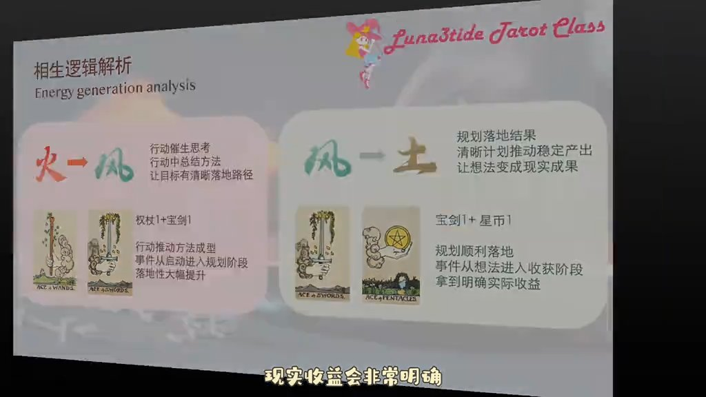

稳定的现实基础与实际成果，会带来充足的安全感，支撑情感的顺畅流动，让关系与感受更稳定、更纯粹。对应牌例是星币A搭配圣杯A——解牌中出现这个组合，代表客户的现实状态会越来越稳定，情感状态也会随之变得顺畅，不管是自我感受还是亲密关系，都会因为现实的稳定变得更安心、更纯粹。

**第四组：水生火（情感驱动行动）**

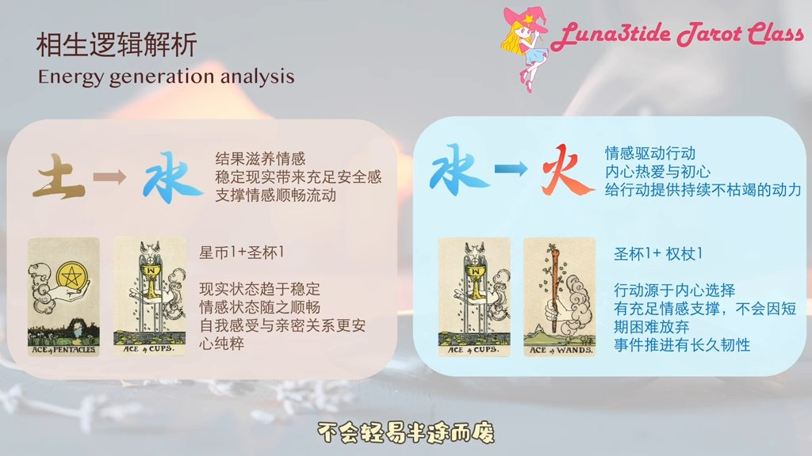

发自内心的热爱、心动与初心，会给行动提供持续的动力，让原本的行动更有韧性，不会轻易半途而废。对应牌例是圣杯A搭配权杖A——解牌中出现这个组合，代表客户的行动是发自内心的选择，有充足的情感支撑，不会因为短期的困难放弃，事件会有长久的推进动力，成功率大幅提升。

---

## 六、四组相克关系详解

**核心要点**：每组相克都针对特定的失衡场景，目的是校准能量、恢复平衡，而非消灭对方。

**第一组：火克土（打破停滞僵局）**

场景：土元素过于稳定，进入停滞、僵化、固守现状的失衡状态。火元素的行动会打破这种停滞的僵局，推动土元素的能量重新流动，从固守变成向前推进。这里的火克土，不是毁掉现有的稳定，而是打破过度僵化的状态，让现实有新的发展可能。对应牌例是星币2搭配权杖A——解牌中出现这个组合，代表客户当前固守现状的状态会被新的行动与机会打破，虽然会有短期的不适应，但最终会推动事件走出停滞，迎来新的发展。

**第二组：土克水（拉回情绪内耗）**

场景：水元素过度波动，进入情绪内耗、沉浸悲伤、脱离现实的失衡状态。土元素的现实结果会把过度发散的情绪拉回当下，让水元素的能量重新回归稳定的流动，从内耗变成专注当下。这里的土克水，不是消灭情绪与感受，而是把过度内耗的情绪拉回现实的支撑中，让感受有落地的方向。对应牌例是圣杯5搭配星币A——解牌中出现这个组合，代表客户当前的情绪内耗会被现实中的成果与机会化解，最终走出情绪迷潭，回归当下，专注于能拿到结果的实际行动。

**第三组：水克风（加入共情温度）**

场景：风元素过度理性，进入冷漠偏执、算计投机、缺乏共情的失衡状态。水元素的共情与真诚，会把过度冰冷的理性拉回到有温度的关系中，让风元素的能量重新回归正向的规划，从偏执算计变成平等沟通。这里的水克风，不是消灭思考与逻辑，而是把过度冷漠的理性加入共情的温度，让沟通与规划更贴合人性。对应牌例是宝剑7搭配圣杯2——解牌中出现这个组合，代表客户当前过于算计冷漠的状态会被真诚的情感沟通化解，最终回归平等关系，用更坦诚的方式处理问题，避免因投机造成损失。

**第四组：风克火（踩下冲动刹车）**

场景：火元素过度爆发，进入鲁莽冲动、盲目对抗、脾气暴躁的失衡状态。风元素的理性思考与规划，会给过度爆发的动能踩下刹车，让火元素的能量重新回归正向的行动，从鲁莽冲动变成有规划的推进。这里的风克火，不是消灭行动与动力，而是把过度失控的动能加入理性的约束，让行动更有方向，不会造成不必要的损失。对应牌例是权杖7搭配宝剑A——解牌中出现这个组合，代表客户当前鲁莽冲动的状态会被理性的思考与规划校准，最终放弃盲目的对抗，找到更好的解决方案，让行动更有效率，避免因冲动造成损失。

---

## 七、生克逻辑的实战应用场景

**核心要点**：元素生克逻辑适用于单牌解读、牌阵解读、逆位解读三大场景，是解牌的底层方法论。

**单牌解读**：通过单张牌的元素属性，判断牌面的核心能量状态，再结合问题，判断这个能量状态是平衡还是失衡，有没有对应的生克调整空间。

**牌阵解读**：这是生克逻辑最核心的应用场景，通过牌阵中牌与牌之间的元素生克关系，找到事件的核心矛盾与发展趋势。

**逆位解读**：逆位的核心就是元素能量的失衡，而生克逻辑就是判断逆位调整方向、给客户提供落地建议的核心方法。

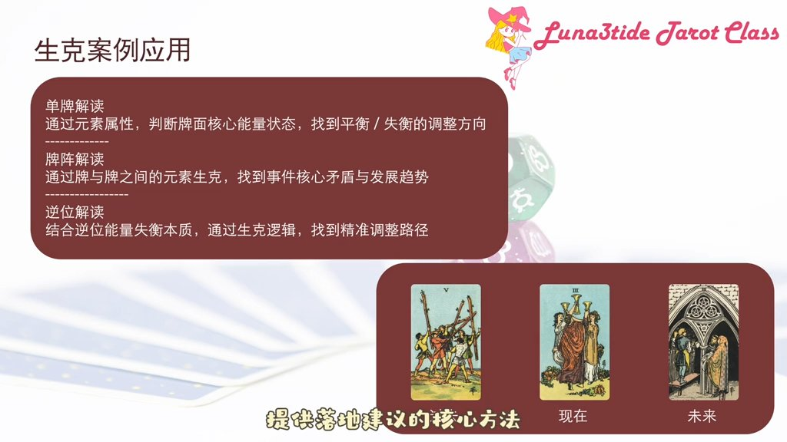

以最常用的三张牌时间流牌阵为例：过去是权杖五（火元素的冲突），推动现在出现圣杯三（水元素的沟通连接），最后落地成为未来的星币三（土元素的合作成果）。这是一个完整的能量闭环，核心矛盾已经化解，事件整体向正向发展。

---

## 八、四大认知误区

**核心要点**：避开这四个误区，才能真正用好元素生克逻辑，而不是被公式束缚。

**误区一：用五行生克公式套塔罗元素。** 忽略两个体系的底层逻辑差异，这是最根源的误区。直接套用公式，必然出现概念混乱、解读出错。很多学习者搞不清楚水和火到底是相生还是相克，根本原因就在于此——在塔罗体系中，水和火既可以相生（水生火：情感驱动行动），也可以相克（火克水的失衡场景），取决于能量状态，而非固定公式。

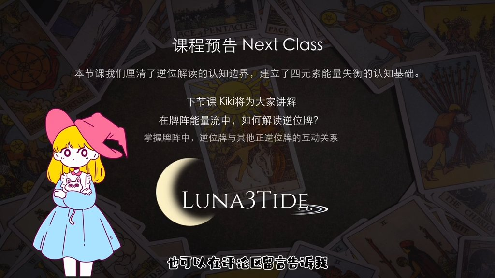

**误区二：认为相生是吉、相克是凶。** 忽略了相克的正向校准作用。塔罗中的生克没有固定吉凶，很多时候相克反而是帮客户校准失衡状态、推动事件正向发展，反而是好事。

**误区三：孤立判断单张牌的元素。** 忽略牌阵中元素的整体互动。解牌的核心一定是看整个牌阵的能量流动，而不是单张牌定吉凶。

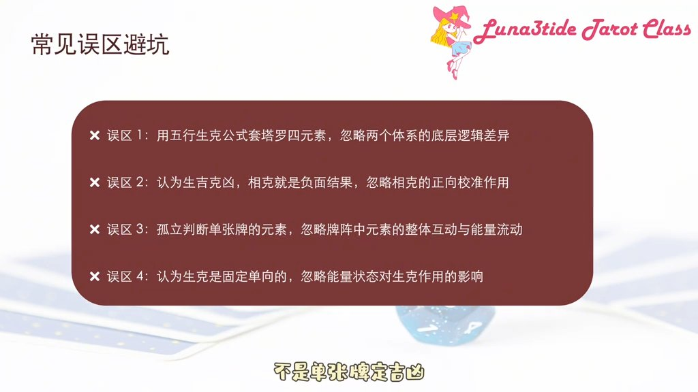

**误区四：认为生克是固定单向的。** 忽略了能量状态对生克方向的影响。塔罗中的生克不是固定谁生谁、谁克谁，而是基于能量的流动状态变化，核心永远是能量的补能与制衡。

---

## 九、核心总结

**核心要点**：一套元素生克逻辑，通吃78张牌，是塔罗解读的真正底层方法论。

塔罗四元素是能量从灵感到显化的完整闭环，核心是流动，不是固定的属性，所有的解读都要基于能量的流动状态展开。相生是能量的正向补能，相克是失衡状态的校准制衡，两者没有固定的吉凶，只看是否匹配当前能量状态，是否能推动事件正向发展。

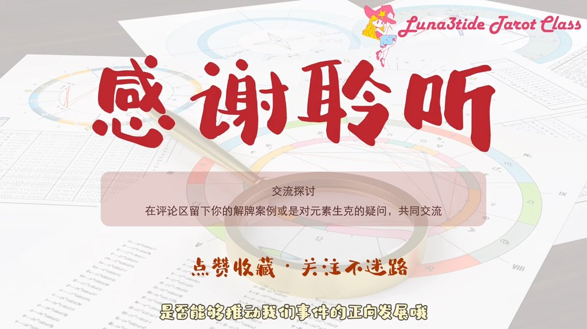

元素生克是塔罗解读的底层逻辑，不管小阿卡纳、大阿卡纳，还是正位、逆位，全牌阵全适用，都可以用这套逻辑完整解读。这是通吃78张牌的核心方法。

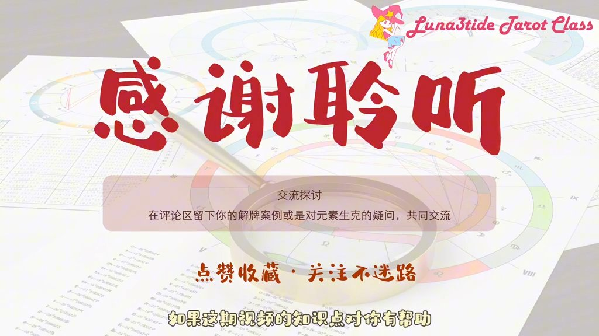
