# 塔罗进阶必学·3态法则｜看懂能量的本质差异 古典占星联动第三弹

> 整理来源：Luna3Tide 抖音视频 | 字幕来源：Whisper large-v3
>
> **学习重点**：三态法则不是性格分类，而是能量在时间维度上的三种运作模式；掌握三态，可以从"背牌义解牌"升级为"看能量解牌"，彻底打通占星与塔罗的底层逻辑。

---

## 为什么你学了塔罗还是解不准牌

**核心要点**：大多数人学的是"塔罗说明书"，只知道牌义关键词，却不知道能量在怎么动。

你是不是学塔罗超过三个月，还在靠背关键词解牌？单牌意思都懂，三张牌摆在一起就懵，只能东拼西凑说废话？解牌永远说不到客户心里去，人家听完只会说"好像是吧"，从来没人说"就是这样"？是不是越学越迷茫，报了一堆课，记了厚厚一本笔记，真到咨询的时候还是脑子一片空白？

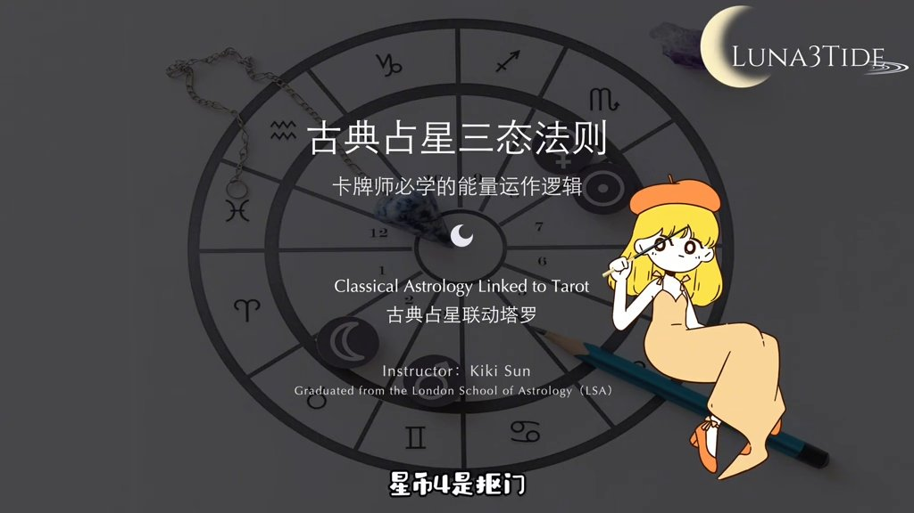

如果中了以上任何一条，问题出在这里：你学的根本不是塔罗，是塔罗说明书。99%的老师只会教"钱币四是抠门""权杖期是有阻碍"，但从来没有人说过，为什么钱币四在这里是抠门，在另一个牌阵里就是稳健？为什么同样是权杖期的逆位，有时候是放弃，有时候是突破？答案就是三态法则。

学完今天这节课，再也不用死记硬背任何关键词，只要看一眼牌的元素和数字，就能瞬间知道这件事的过去、现在和未来，以及它接下来会如何发展。

---

## 三态法则的本质定义

**核心要点**：三态是一种时间能量观，描述能量在发展周期中的三种运作模式，而非性格标签。

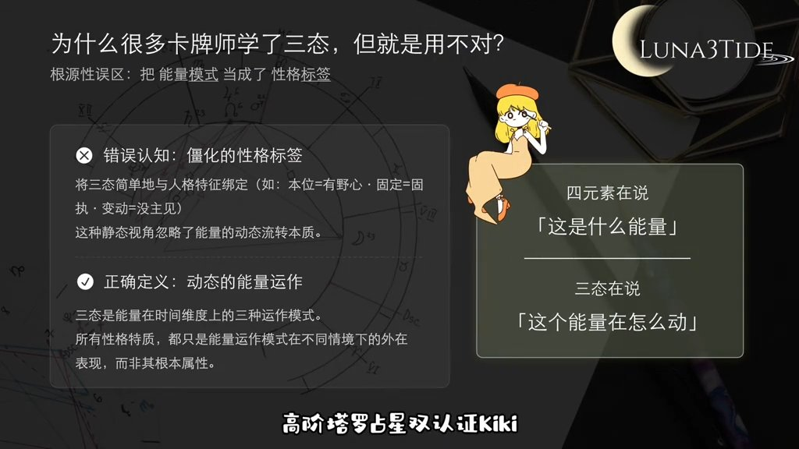

很多人对三态的认知还停留在"本位就是有野心、爱当老大，固定就是固执一根筋，变动就是没主见、三分钟热度"。如果你也是这么理解的，那之前学的根本不是三态，只是一堆性格标签。

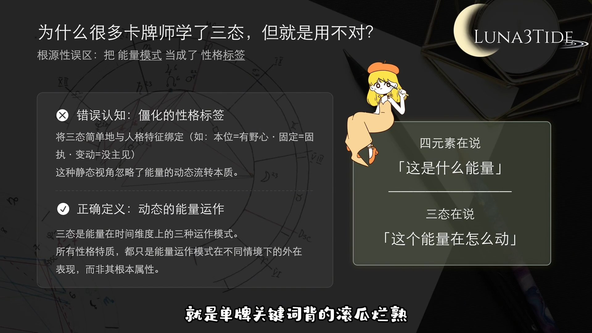

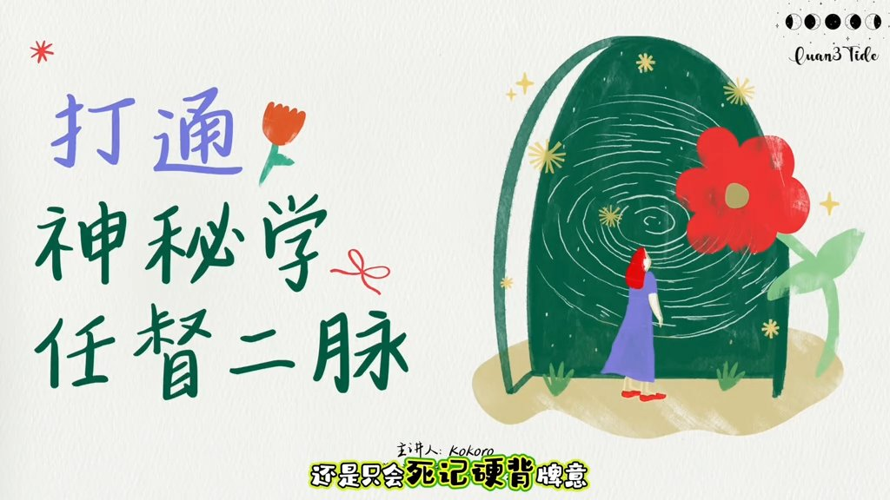

三态这个概念最早来自托勒密的《占星四书》，本质上是一种时间能量观。今天整节课的核心只有一句话：**三态绝对不是性格分类，而是能量在时间维度上的三种运作模式。**

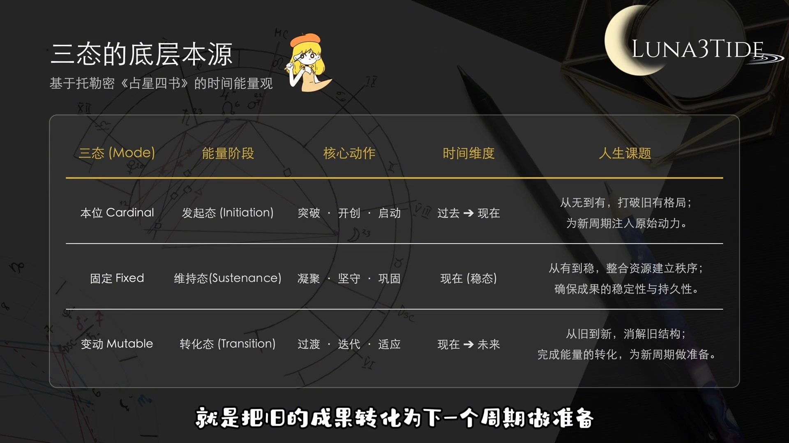

我们可以把任何一件事情的发展周期分成三个阶段。第一个阶段是从无到有，把一件事从想法变成行动，这叫发起态，也就是本位态。第二个阶段是把已经开始的事情坚持下去、把成果稳住，这叫维持态，也就是固定态。第三个阶段是把旧的成果转化，为下一个周期做准备，这叫转化态，也就是变动态。

对应到时间维度：本位态连接过去和现在，负责开启新周期；固定态锚定当下，负责稳定和深化；变动态连接现在和未来，负责过渡和迭代。所有的性格特质，都只是这三种能量运作模式在人身上的外在表现，而不是它们的根本属性。

---

## 三种能量模式深度解析

**核心要点**：本位是点火器（启动），固定是蓄电池（坚守），变动是转换器（适应），三者各有所长，失衡时也各有弱点。

**本位态——能量的点火器**

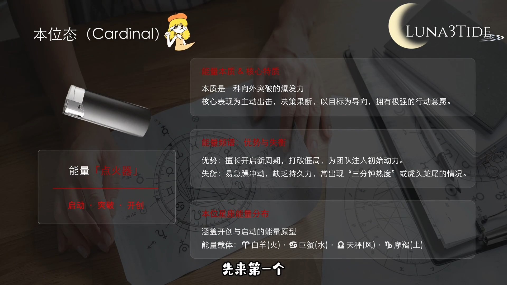

本位态的能量本质是一种向外突破的爆发力，核心动作就是启动。就像打火机，咔嚓一下，不管后面能不能烧旺，先点着再说。所以本位能量强的人天生是行动派，决策果断，目标感极强，想到就去做，最擅长打破僵局，在一片混沌中开出一条路来。团队里只要有一个本位星座的人，就永远不会冷场。但本位态的失衡也很明显：容易急躁冲动，缺乏持久力，点火很快，但烧一会就灭了，经常虎头蛇尾。对应占星中的四个本位星座：白羊、巨蟹、天秤、摩羯。

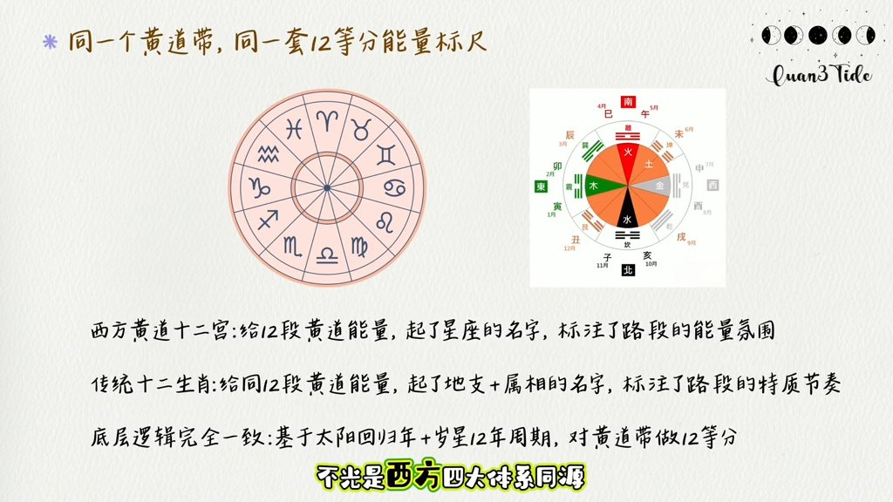

**固定态——能量的蓄电池**

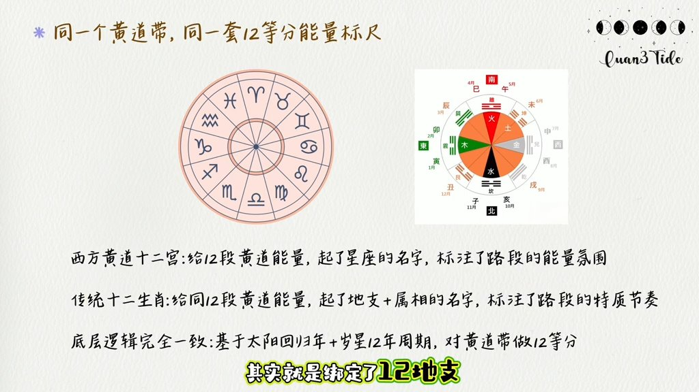

如果说本位态负责点火，那固定态就负责把火持续烧下去。它的能量本质是向内凝聚的持久力。固定能量强的人是天生的坚守者，能够长期专注在一件事情上，不轻易被外界干扰，就像蓄电池，一旦充满电就能稳定输出很长时间。最擅长把长远目标变成实实在在的成果，忠诚度极高，一旦认定了就不会轻易改变。但固定态的失衡就是固执和保守，抗拒任何形式的改变，喜欢待在舒适区，思维和行动容易钻牛角尖，很难适应环境的快速变化。对应四个固定星座：狮子、天蝎、水瓶、金牛。

**变动态——能量的转换器**

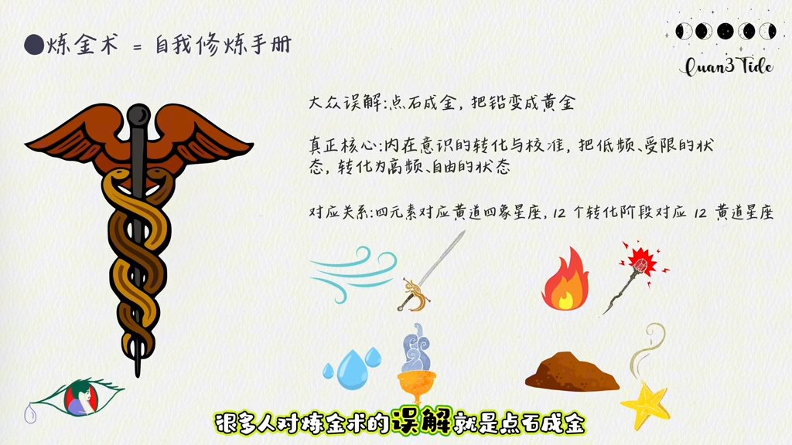

变动态的能量本质是灵活流动的适应力，就像一个USB扩展坞，能把一种能量转换成另一种能量，在不同状态之间无缝切换。变动能量强的人思维极其灵活，学习能力超强，擅长沟通和连接，能够在变动中找到机会，韧性也很强，不管环境怎么变都能快速适应并活得很好。但变动态的失衡就是浮躁和犹豫，注意力太容易分散，什么都想做但什么都做不精，缺乏边界感，很容易被别人的意见影响，也很难长期坚持一件事。对应四个变动星座：射手、双鱼、双子、处女。

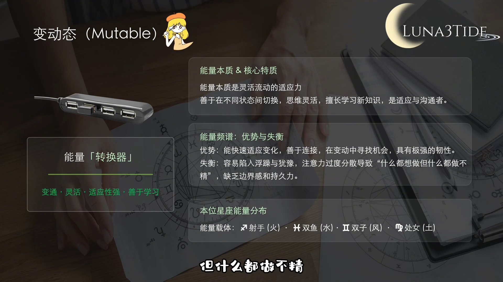

---

## 三态在塔罗宫廷牌中的对应

**核心要点**：16张宫廷牌对应能量发展的四个阶段，用三态理解宫廷牌，不再需要死记16个人物的性格。

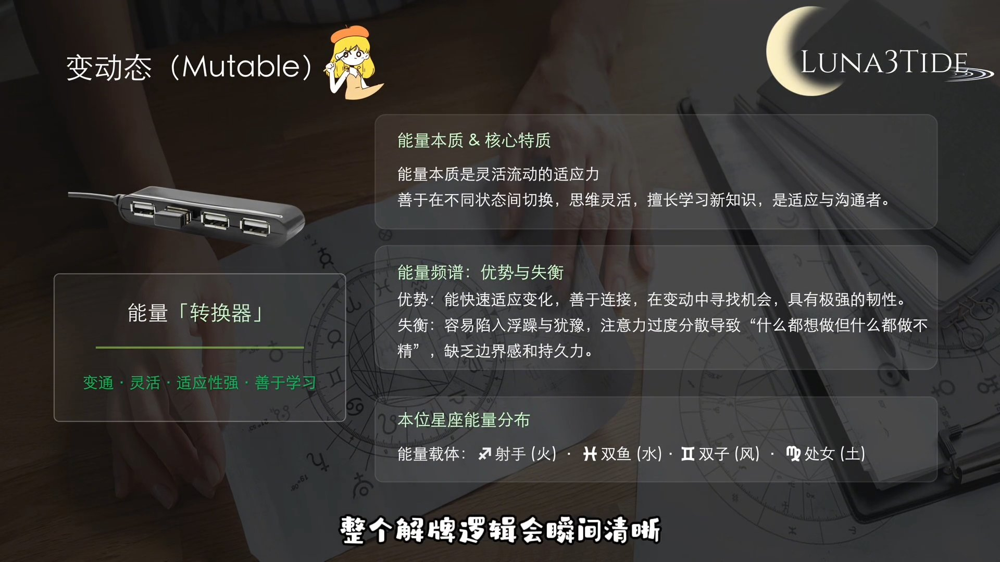

宫廷牌难，难就难在人物太多、性格太复杂，但用三态一划分，瞬间就清楚了。16张宫廷牌其实就是能量发展的四个阶段：

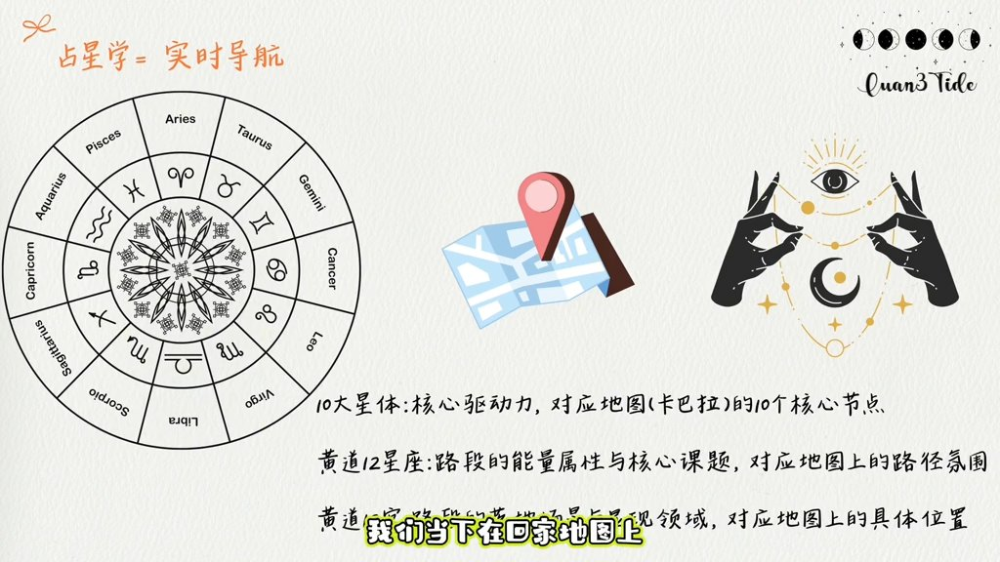

侍从是预备态，是元素的学习者，还没有完全觉醒，就像刚入行的实习生。骑士是变动态，是元素的执行者，能量向外快速流动，充满行动力和不确定性。王后是本位态，是元素的发起者，能量从内向外滋养，拥有最纯粹的阴性力量。国王是固定态，是元素的掌控者，能量向内稳定凝聚，是该元素能量的最高形式。

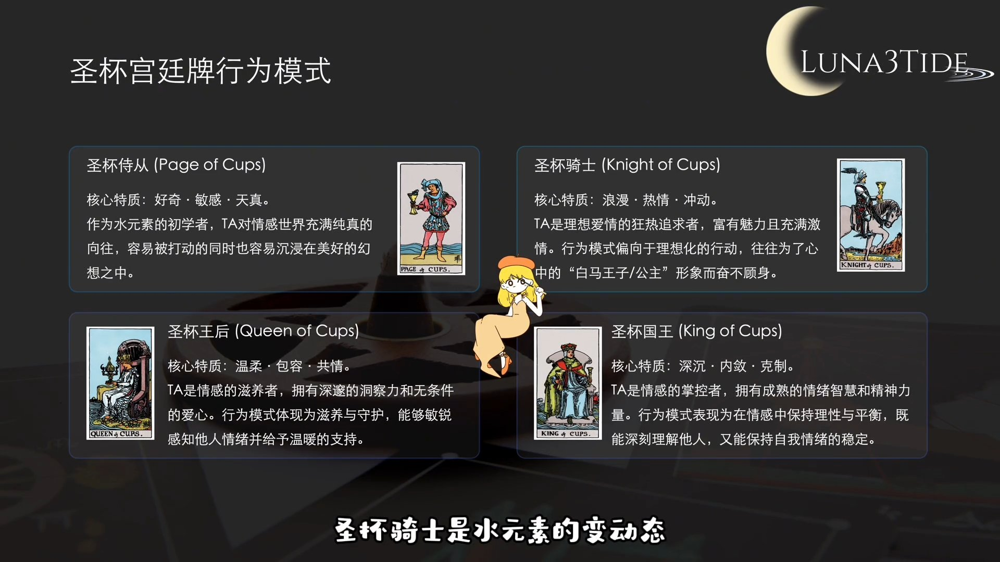

以水元素圣杯牌组为例：圣杯侍从是水元素的初学者，好奇、敏感、天真，对情感世界充满纯真和向往；圣杯骑士是水元素的变动态，浪漫热情冲动，是理想爱情的狂热追求者，可以为爱奋不顾身；圣杯王后是水元素的本位态，温柔包容、善于共情，是情感的滋养者，能敏锐感知别人的情绪并给予支持；圣杯国王是水元素的固定态，深沉内敛克制，是情感的掌控者，拥有成熟的情绪智慧，既能理解别人，又能保持自己的稳定。

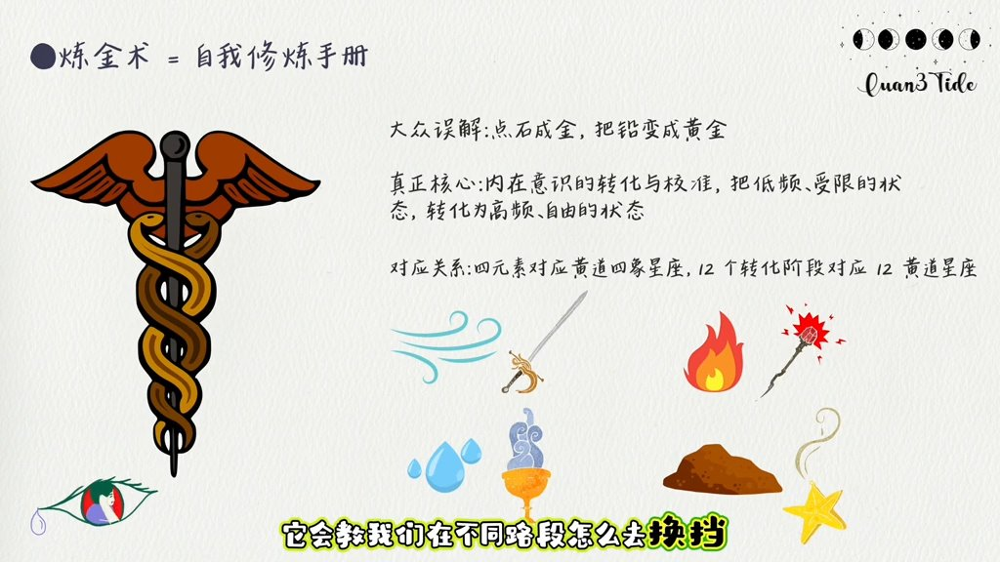

用三态去看宫廷牌，只需要知道元素加三态，就可以自己推导出这张牌的核心含义。

---

## 三态在小阿卡纳数字牌中的对应

**核心要点**：数字牌按三态分为三组，同组数字遵循相同的能量逻辑，从1到10构成一个完整的能量演化闭环。

这是今天最重磅的部分，几乎没有人会专门讲，但它是理解小阿卡纳能量演进的关键。数字牌的三态分组如下：

本位组（能量节点）：1、4、7、10号牌
固定组（能量深化）：2、5、8号牌
变动组（能量转化）：3、6、9号牌

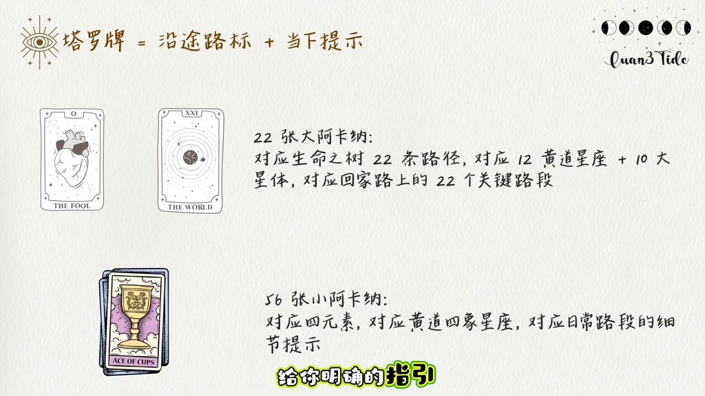

所有同组的数字牌都遵循完全相同的能量逻辑。1是绝对发起，10是周期终结，首尾相连，构成了能量演化的完整闭环。

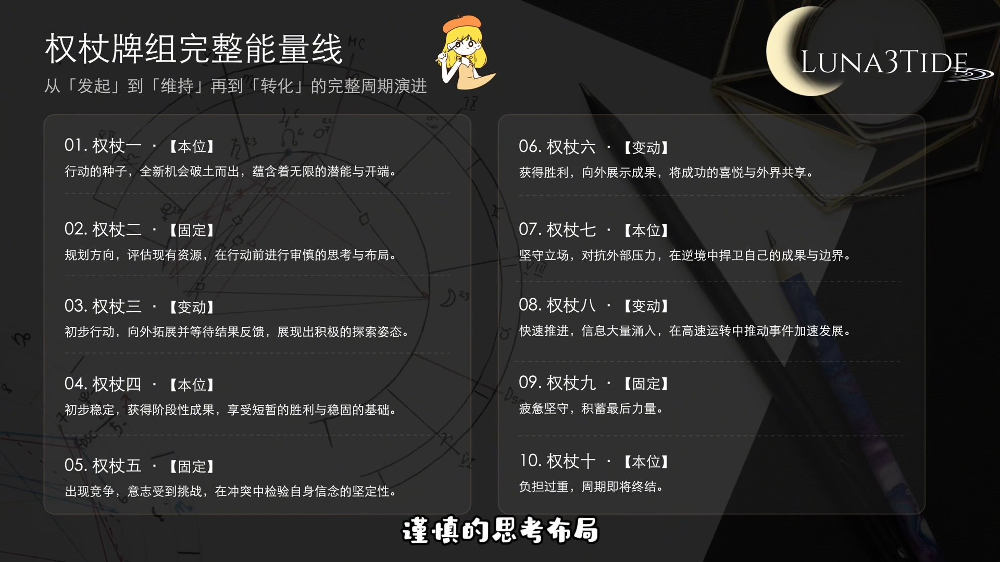

以权杖牌组为例，走一遍完整的能量周期：权杖一（本位）——心动的种子，全新机会破土而出；权杖二（固定）——规划方向，评估资源，谨慎思考布局；权杖三（变动）——初步行动，向外拓展，等待结果反馈；权杖四（本位）——初步稳定，获得了阶段性成果；权杖五（固定）——出现竞争，持续受到挑战；权杖六（变动）——获得胜利，向外展示成果；权杖七（本位）——坚守立场，对抗外部压力；权杖八（变动）——快速推进，事件加速发展；权杖九（固定）——疲惫坚守，积蓄最后力量；权杖十（本位）——负担过重，周期即将终结。

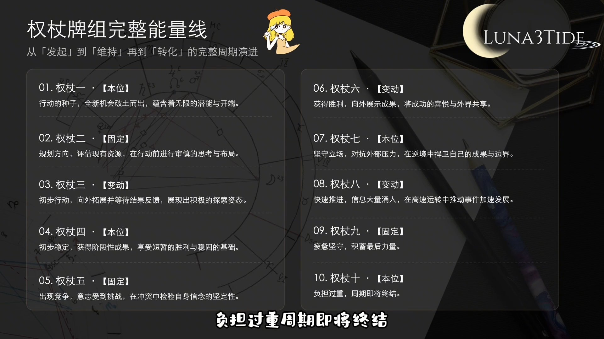

从一到十，就是一个完整的"发起—维持—转化"循环，每一张牌都不是孤立的，而是能量流动中的一个节点。以后解小阿卡纳数字牌，只需要看它在哪一个组，就知道它处于事件发展的哪个阶段。

---

## 三态×四元素：完整能量矩阵

**核心要点**：将三态与四元素结合，得到完整的占星-塔罗对应矩阵，占星与塔罗从此彻底打通。

把三态和四元素结合起来，就得到了完整的能量矩阵：

火元素：本位——白羊座/权杖一（行动的发起），固定——狮子座/权杖五（意志的维持），变动——射手座/权杖八（信念的转化）

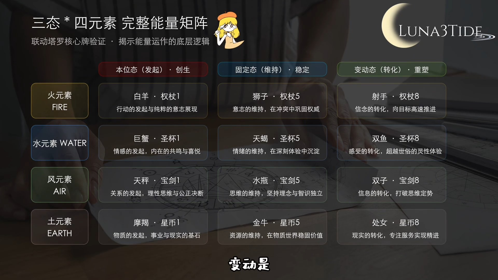

水元素：本位——巨蟹座/圣杯一（情感的发起），固定——天蝎座/圣杯五（情绪的维持），变动——双鱼座/圣杯八（感受的转化）

风元素：本位——天秤座/宝剑一（关系的发起），固定——水瓶座/宝剑五（思维的维持），变动——双子座/宝剑八（信息的转化）

土元素：本位——摩羯座/星币一（物质的发起），固定——金牛座/星币五（资源的维持），变动——处女座/星币八（现实的转化）

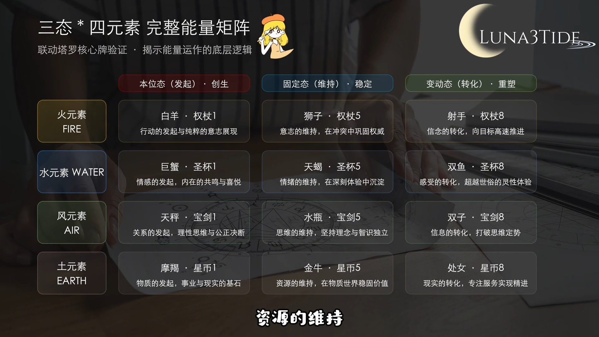

有了这个矩阵，看到一个星座就能对应说出它的塔罗牌，看到一张塔罗牌就能说出它对应的星座能量，占星和塔罗就完全打通了。

---

## 实战案例：三态法则解牌 vs 普通解牌

**核心要点**：三态解牌不只告诉你"会发生什么"，更能揭示"为什么会发生"，并给出有针对性的行动建议。

**问题**：筹备了三个月的副业项目，下周能顺利推进吗？
**牌面**：正位星币四 / 逆位权杖七 / 正位宝剑六

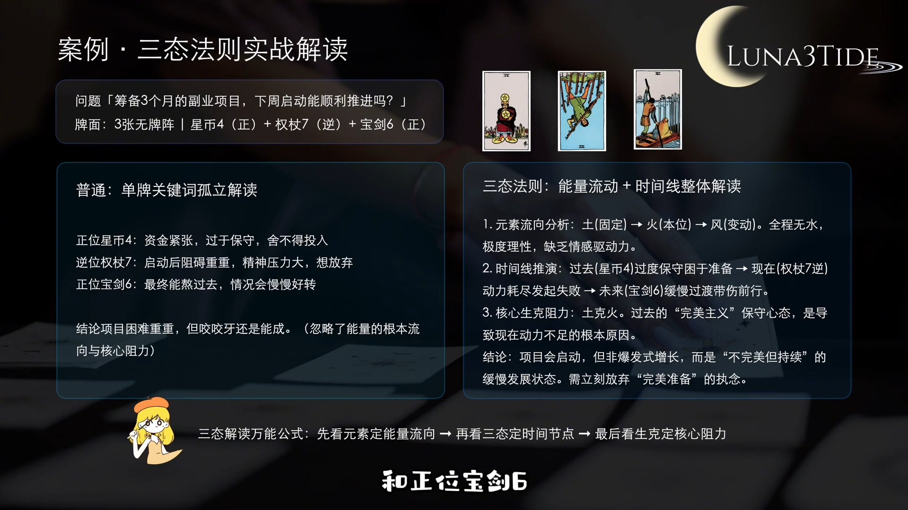

**普通解法**：正位星币四——资金紧张，过于保守，舍不得投入；逆位权杖七——启动后阻碍重重，精神压力大，想放弃；正位宝剑六——最终能熬过去，情况会慢慢好转。结论：项目困难重重，但咬咬牙坚持还是能成。这个解读很熟悉，但非常表面，只告诉了会发生什么，没有说为什么会发生，也没有给出任何有价值的建议。

**三态法则解法（三步走）**：

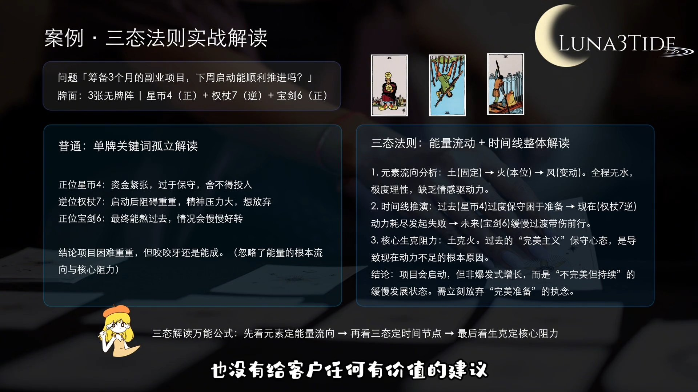

第一步，看元素，定能量流向。土元素（星币四，固定态）→ 火元素（权杖七，本位态）→ 风元素（宝剑六，变动态）。全程没有水元素，说明整个过程极度理性，缺乏情感驱动力，当事人对这个项目其实没有真正的热情。

第二步，看三态，定时间节点。过去——星币四固定态，当事人过去三个月一直在维持准备的状态，过度保守，追求完美，迟迟不敢启动。现在——权杖七逆位的本位态，本位态代表发起，逆位就是发起失败，现在的问题是动力耗尽，根本不想启动了。未来——宝剑六变动态，变动态代表过渡，所以未来不会爆发式增长，而是带着伤患缓慢前进。

第三步，看元素缺失，定核心阻力。土克火——过去的完美主义和保守心态，消耗了发起的动力，这才是导致现在动力不足的根本原因。

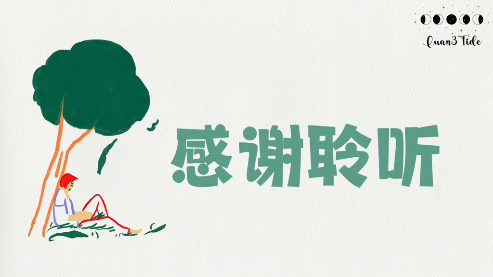

**最终结论**：项目会启动，但不会是想象中的爆发式增长，而是不完美但持续的缓慢发展状态。当下最需要做的，就是立刻放弃"万事俱备再启动"的执念，先干起来再说。

---

## 三态解牌万能公式与总结

**核心要点**：三步公式——看元素定流向、看三态定节点、看缺失定阻力，适用于任何牌阵。

**解牌万能公式**：第一步，看元素，定能量的流向；第二步，看三态，定时间节点；第三步，看元素缺失，定核心阻力。不管遇到什么牌阵，都可以用这个公式套用。

**本节课重点回顾**：

三态的本质定义：三态是能量在时间维度的三种运作模式，而非性格标签。本位是发起，固定是维持，变动是转化。

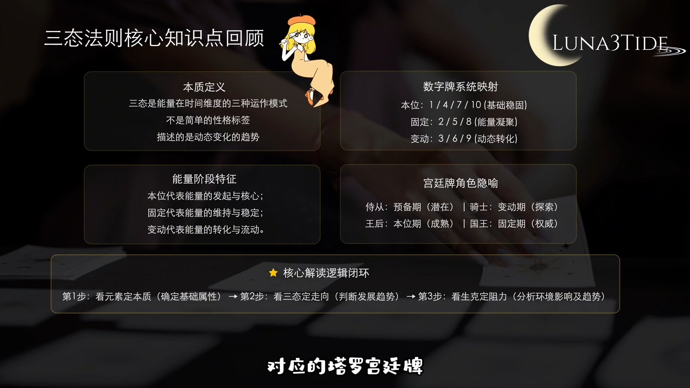

三态的能量特质：本位是点火器，擅长开启；固定是蓄电池，擅长坚守；变动是转换器，擅长适应。

对应塔罗宫廷牌：侍从是预备，骑士是变动，王后是本位，国王是固定。

对应塔罗数字牌：本位组是1、4、7、10；固定组是2、5、8；变动组是3、6、9。

解读逻辑：先看元素，再看三态，最后看元素缺失。

本节课是古典占星联动塔罗系列的第三节，下一节将讲解七大古典行星的本质，以及从占星原型到22张大阿卡纳的完整对应，帮助彻底搞懂大阿卡纳的核心含义，重塑塔罗解读体系。
