# 颠覆认知·逆位牌根本不是坏牌，90%的人都理解错了——逆位牌的底层逻辑

> 整理来源：Luna3Tide 抖音视频 | 字幕来源：Whisper large-v3-turbo
>
> **学习重点**：逆位牌与吉凶无关，只反映能量的三种流动状态；掌握"先看牌定能量、再看位置定领域、只讲状态不讲焦虑"的解读公式，彻底告别对逆位的恐惧。

---

## 一、逆位牌的核心本质：能量流动的偏差，而非凶兆

**核心要点**：逆位牌不是坏牌，它只是在告诉你，身上这股能量的表达方式或流动状态出现了一点偏差。

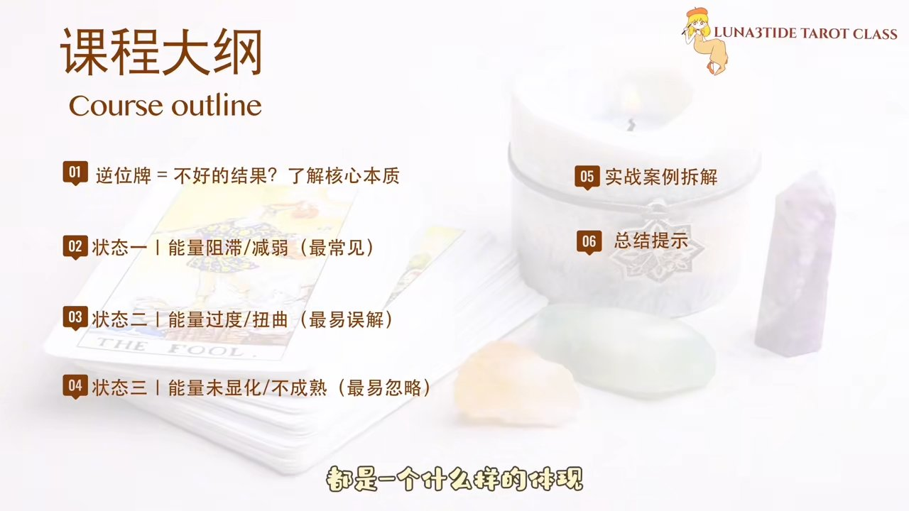

很多刚学塔罗的同学，以及对塔罗感兴趣的朋友，包括来咨询的客户，一抽到逆位牌整个人就慌了——"是不是不好？是不是要出事？是不是我不行？"在这里要先给大家吃一颗定心丸：逆位牌根本不是坏牌，它跟吉凶没有任何关系。

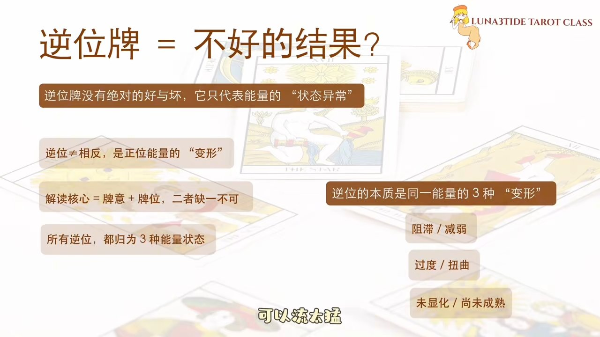

逆位真正在告诉你的只有一件事，就是你身上这股能量的表达方式、流动状态出了一点点偏差。就像水一样，水可以正常流，也可以被堵住，可以流太猛，也可以藏在地下。水本身没有好坏，只是流动的状态不一样。塔罗逆位也是一模一样。

不管大牌、小牌，所有的逆位牌都可以归纳成三种最核心的能量状态：第一种是能量阻滞，第二种是能量失控（过度扭曲），第三种是能量未显化（尚未成熟）。

---

## 二、三种逆位能量状态详解

### 状态一：能量阻滞——进程延迟或中断

**核心要点**：能量阻滞不代表能力消失，只是暂时被卡住，允许自己停下来充电，能量随时可以回归。

对应的标志性大阿卡纳牌是**魔术师**。魔术师正位代表行动力、才华、执行力、资源整合等能力，是把想法变成现实的能力，能量顺畅、敢想敢做、游刃有余。

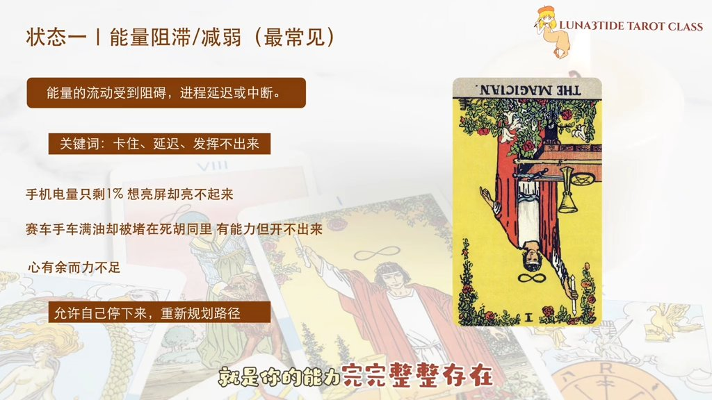

这里有一个关键点：大阿卡纳所代表的是我们的核心能力与人生课题，能量不会平白无故消失。所以魔术师逆位最精准的定义是：你的能力完完整整存在，只是暂时被卡住了，发挥不出来。这种情况在生活里太常见了——你明明很有才华，却不敢在人前展示，怕被评价；你很会做事，却在一个压抑的环境里动弹不得；你明明有目标有想法，但被现实条件困住了，想动动不了。

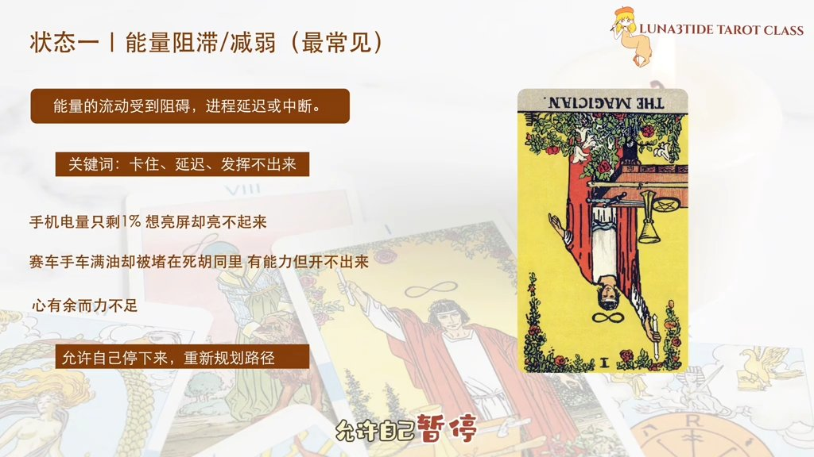

所以一定要记住：魔术师逆位绝对不是你没能力，是你的能力被暂时锁住了，可能是环境，可能是心态，可能是时机，只要锁打开，能量立刻就能出来。这个时候要允许自己停下来，重新看看手里有什么，重新整合资源，重新规划一条新的路径。

就像手机只剩1%的电，这时候不停地按亮屏只会消耗电量，最后自动关机。正确的做法是先充电，等充满一定电量再开机，你会发现手机功能完好无损，照常能用。

### 状态二：能量失控——过度与扭曲

**核心要点**：能量失控不是能力有问题，而是好的能量用过了头，物极必反，需要找回节制与平衡。

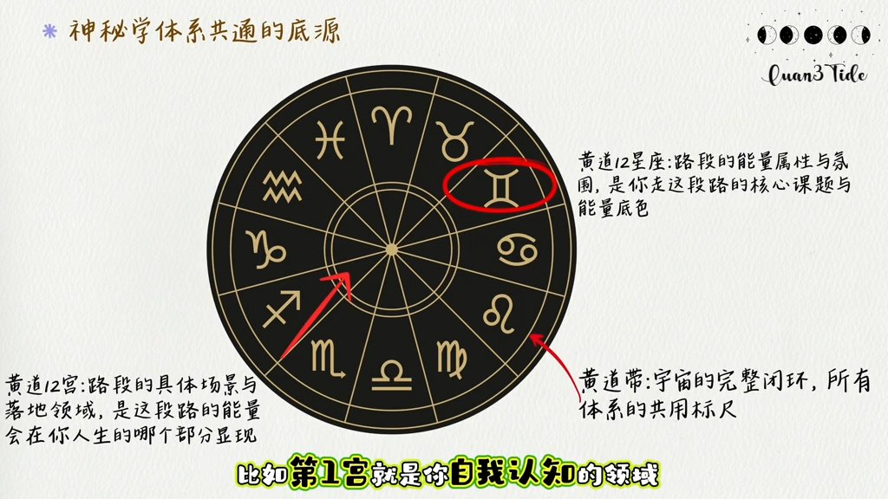

这是最容易被误解的一种状态，因为它是事物的过度极端，物极必反。对应的标志性牌是**女皇**。女皇在塔罗里是非常温柔包容的一张牌，代表滋养、付出、关怀、包容、情绪与自我接纳，正位是爱自己也爱别人，温柔有力量。

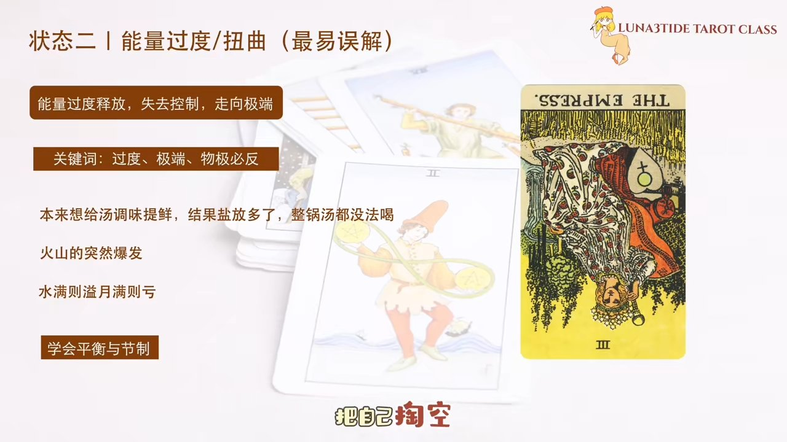

女皇逆位不是你不温柔，也不是你不会爱，而是你把这份好能量用过头了——对一段感情太投入、太付出，把自己掏空，反而把对方推远；对一件事情过于负责，太紧绷，把自己压得喘不过气；很想被喜欢、很想被认可，所以变得小心翼翼，不断内耗。这就是能量的过度。

水满则溢，世间万物要保持在节制与平衡的状态。女皇逆位不是不好，而是太想做好、太用力，能量过载，过了头就会变成消耗。

### 状态三：能量未显化——蛰伏与积蓄

**核心要点**：能量未显化是黎明前最黑暗的时刻，希望真实存在，只是尚未落地，当下的沉默与等待都是在为光明蓄力。

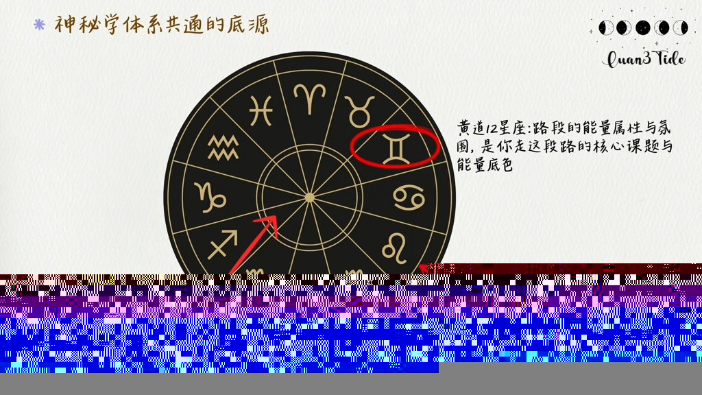

这是最容易被忽略的一种状态，就像种子在土壤中等待发芽，是黎明前最黑暗的时刻，处于潜在蛰伏的阶段。对应的标志性牌是**星星**。星星牌代表希望、信心、方向与未来，是黑暗里的光、迷茫里的路。

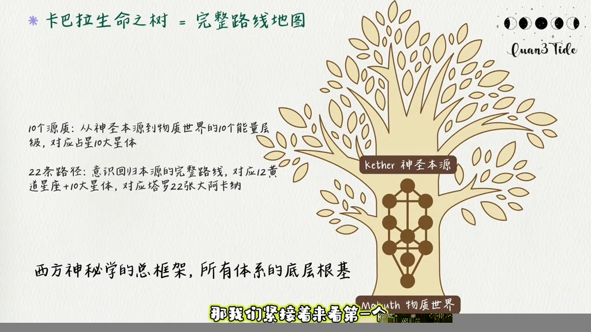

但很多人一看到星星逆位就觉得"完蛋了，没有希望了，没有未来了"，这是完全错误的。星星逆位真正的意思是：你的希望、你的方向真真实实地存在，只是暂时还没有落地，还没有显化出来。你想变好也愿意努力，只是暂时迷茫，不知道该怎么走；你心里有目标，可是现实还看不到结果；你在慢慢坚持、慢慢沉淀，但外界好像看不到任何变化。

星星逆位不是没有希望，而是正在黑暗里悄悄蓄力。你现在感受到的沉默、等待、迷茫、不安，都是在为后面的光明做准备。宇宙的核心法则是有因必有果，能量是守恒的，你付出了多少，就会回报到你身上多少。

---

## 三、逆位解读公式与牌阵应用

**核心要点**：逆位解读必须结合牌义与牌位两个维度，只讲能量状态，不讲吉凶焦虑。

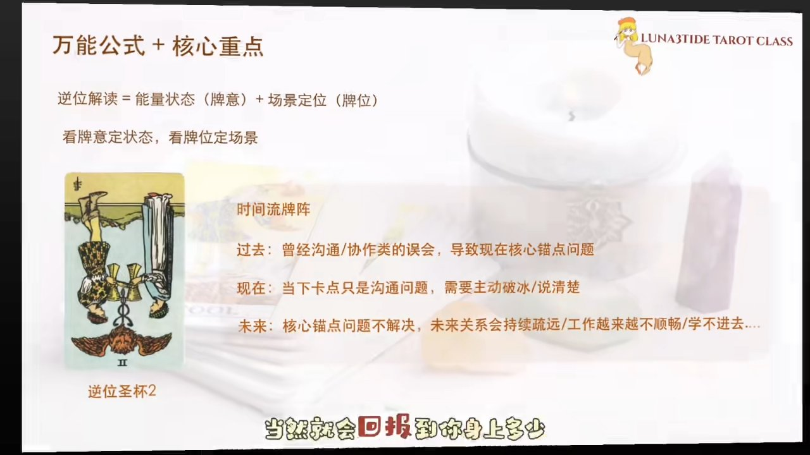

这里给大家一个永远不会错的逆位解读公式：**先看牌定能量状态，再看位置定人生领域，最后只讲状态，不讲焦虑。** 尤其是大阿卡纳逆位，记住一句话：能力永远都在，只是能量状态需要稍微调整一下。逆位不是惩罚，是提醒，它带我们看见问题，也帮我们找到方向。

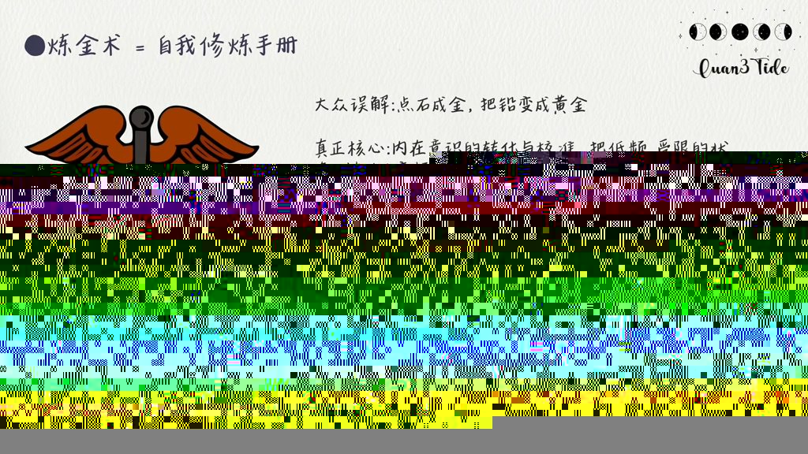

作为塔罗师，我们是要为客户解决问题，而不是给客户制造问题。所以逆位只讲状态，不讲吉凶——告诉客户问题在哪、为什么、可以怎么调整。大阿卡纳永远代表我们最底层、最核心的能力，逆位只是能力的表达方式处于小问题状态，调整一下，能量立刻就可以回归。

逆位牌同时也需要结合牌阵中的位置来看。以最简单的时间流牌阵为例，以圣剑二逆位为例：在**过去位**，代表曾经的沟通或写作类误会，导致了现在核心问题的发生；在**现在位**，提示当下的卡点只是沟通问题，需要主动破冰或讲清楚事情；在**未来位**，则提示核心问题不解决，未来关系会持续疏远，职场场景下工作会越来越不顺畅，学业场景下则越来越学不进去。

---

## 四、实战案例：感情分手后的疗愈解读

**核心要点**：三张圣杯逆位揭示客户被情绪淹没、封闭内心的状态，解读重点在于引导接纳情绪、打开心门。

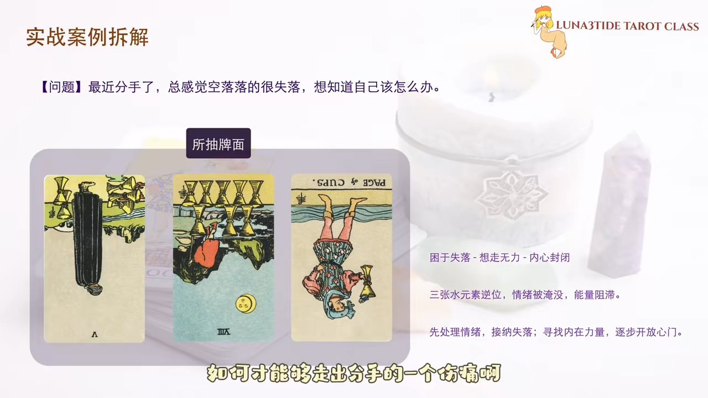

客户问题：如何走出分手的伤痛，总感觉空落落很失落，不知道该怎么办。抽到三张全逆位牌，且都是圣杯牌。圣杯对应水元素，三张全逆位说明客户完全被情绪淹没，能量处于阻滞状态。

第一张**圣杯五逆位**：圣杯五正位是只看到面前倒掉的三个杯子，却忽视了身后还有两个完好的水杯，提示要换一种角度去看。逆位则代表客户被困在过去的失落中，拒绝接受外界的支持。

第二张**圣杯八逆位**：表示理智上想离开这种痛苦，但情感上却无能为力，走不出去。

第三张**圣杯侍从逆位**：侍从在宫廷牌中代表初生、尝试的力量，逆位则代表客户将自己的内心封闭起来，不愿意接受外界的帮助，甚至拒绝新的情感。

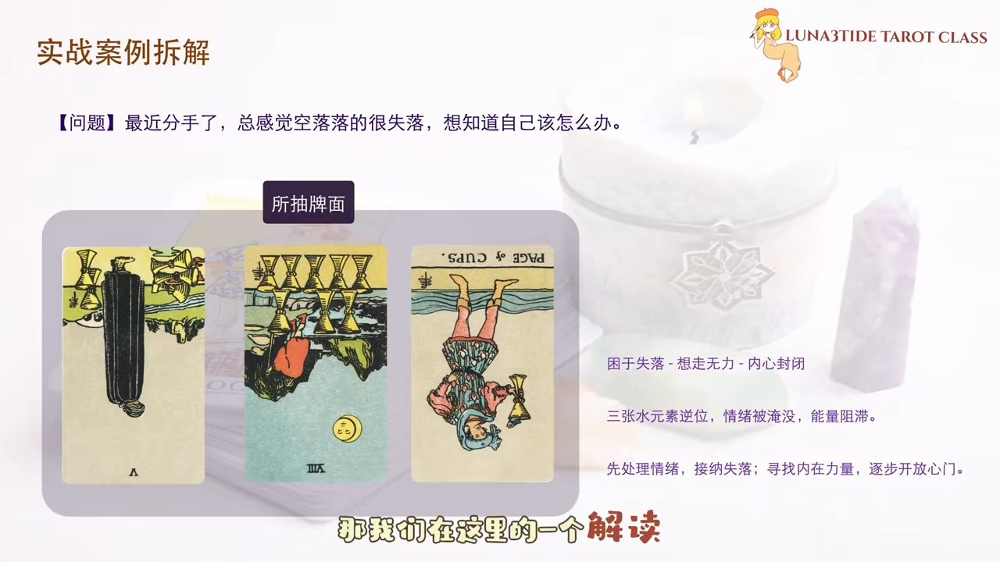

解读落地建议的重点应放在：首先处理情绪，让客户接纳自己的情绪——有情绪是正常的，有失落感是正常的，因为付出了感情所以感到失落，这非常正常。引导客户从内在把自己的心门打开，才能调整好状态，迎接新的可能。

---

## 五、总结

**核心要点**：逆位是提醒，不是惩罚；所有逆位都可以被调整、被修复、被回归平衡。

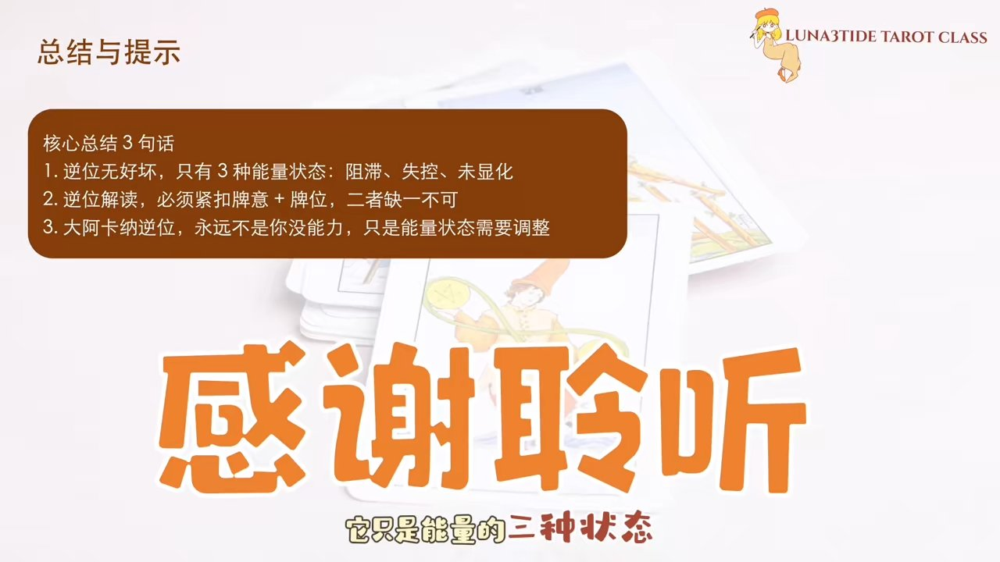

用三句话总结这堂课：第一，逆位没有吉凶，只是能量的三种状态——阻滞、失控、未显化；第二，逆位解读必须结合牌义加牌位，两者缺一不可；第三，大阿卡纳逆位永远不是你没能力，只是能量状态需要调整。

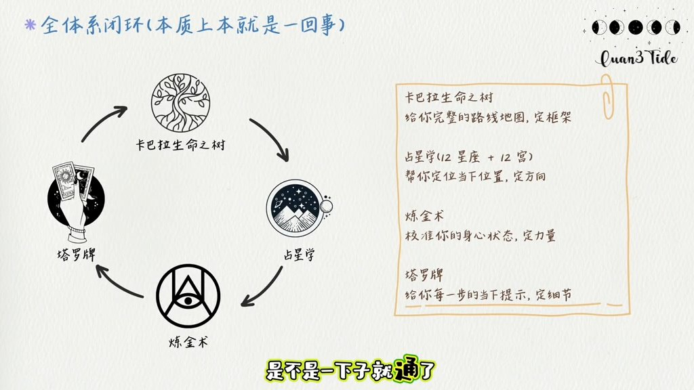

逆位绝对不是惩罚，是提醒，是提醒你看见自己的能量正在以什么方式流动。所有的逆位都是可以被调整、被修复、被回归平衡的。塔罗不是用来制造焦虑的，是用来看见自己的内心、理解自己的内心、支持自己行动的。逆位也一样，它不可怕，很真实，只是在告诉你：调整一下状态，你本来就很好，你本来就可以。
