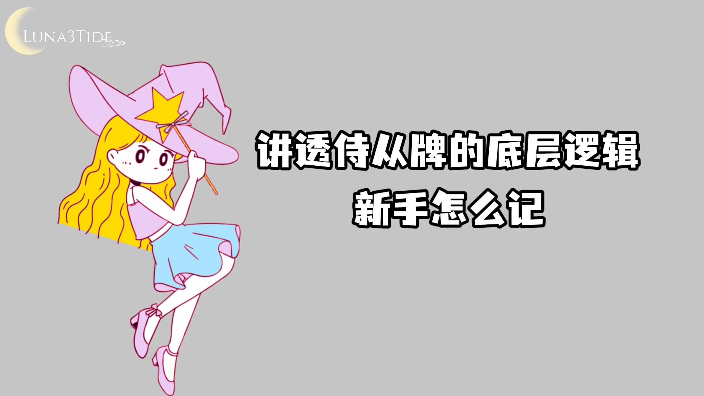
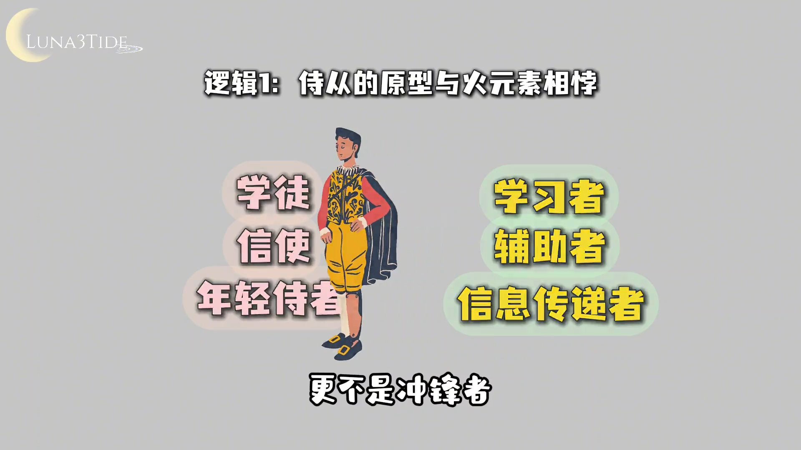
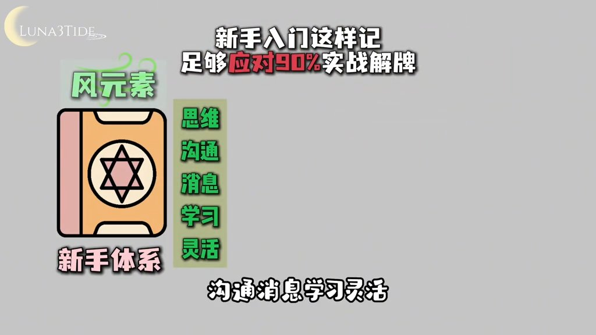
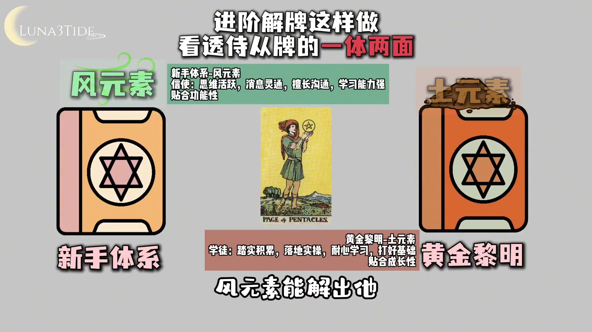
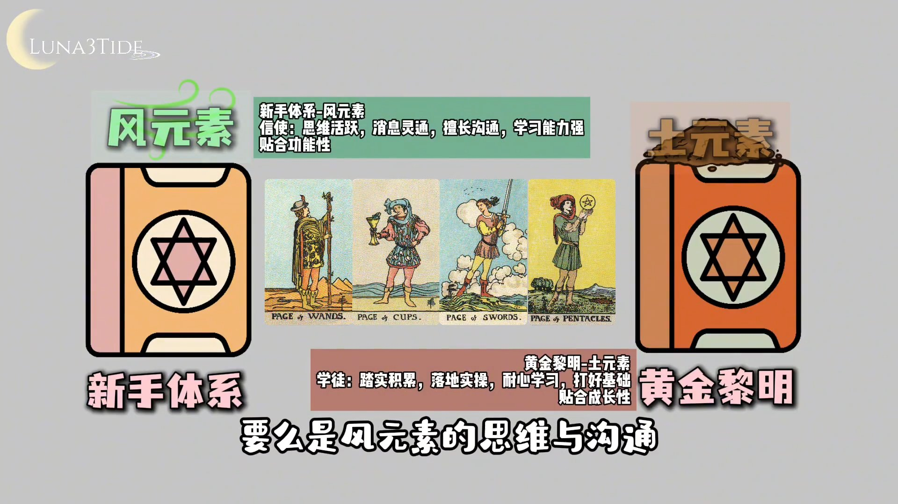

# 为什么塔罗侍从叠加没有火？宫廷牌的元素秘密

> 整理来源：Luna3Tide 抖音视频 | 字幕来源：Whisper large-v3-turbo
>
> **学习重点**：侍从牌在所有塔罗体系中只有风元素和土元素两种归属，从未对应火元素——理解背后的原型逻辑，是进阶解牌的关键基础。

---

## 先立铁则：侍从牌没有火元素

**核心要点**：所有塔罗体系中，侍从牌只有两个元素归属，没有任何一个体系将侍从牌定为火元素。

前面我们讲了皇后和骑士的叠加人物元素逻辑，今天来讲侍从牌。先立一条铁则：在所有塔罗体系的宫廷牌里，侍从牌只有两个元素归属，没有一个体系给侍从牌定过火元素。

很多新手会把侍从和骑士搞混，觉得侍从也是年轻人、也有行动力，为什么不能对应火元素？今天这条视频就给大家讲透背后的底层逻辑——新手怎么记，进阶怎么用双归属解牌。

---

## 两大体系的归属

**核心要点**：国内新手友好体系中侍从叠加风元素，黄金黎明经典体系中侍从叠加土元素，两者各有侧重，但都没有火元素。

先明确侍从牌的两大体系归属：国内新手友好体系里，侍从等于叠加风元素；黄金黎明经典体系里，侍从等于叠加土元素。没有其他版本，也没有火元素。

---

## 为什么永远不会是火元素

**核心要点**：侍从的原型是学徒与信使，与火元素"冲锋爆发"的核心定位从根源上就完全相背。

核心原因有两个。

第一，侍从的原型本质和火元素的核心完全相背。西方宫廷里，侍从的原型是学徒、信使、年轻侍者，核心定位是学习者、辅助者、信息传递者，不是决策者，更不是冲锋者。而火元素的核心是极致的行动力、爆发力、目标感、领导力，是冲锋在前的角色，不是跟在后面的侍从。两者的原型定位从根源上就完全不同，所以永远不可能绑定火元素。

第二，两大体系的逻辑都完美贴合侍从的原型，只是侧重点不同。新手体系里的风元素，侧重的是侍从"信使"的身份：思维活跃、消息灵通、擅长沟通、学习能力强、灵活多变——这是风元素的核心本质，完全贴合侍从的功能性。黄金黎明体系里的土元素，侧重的是侍从"学徒"的身份：踏实积累、落地实操、耐心学习、打好基础——这是土元素的核心本质，完全贴合侍从的成长性。两个版本都贴合原型，只是角度不同，但都和火元素的冲锋爆发没有任何关系。

---

## 新手入门建议：先记风元素

**核心要点**：入门阶段先牢记"侍从叠加风元素"，足以应对90%的实战解牌场景。

入门阶段，先记住侍从等于叠加风元素，暂时不要混入土元素的版本。风元素的思维、沟通、消息、学习、灵活，是侍从牌最核心、最常见的牌义：

- 宝剑侍从：信息收集、观察力
- 圣杯侍从：情感表达、创意灵感
- 权杖侍从：新想法、新机会
- 钱币侍从：新学习计划、理财思路

这四张牌的核心都围绕着"新的消息、新的学习、新的想法"，而这正是风元素的核心本质。新手记住这一点，永远不会解错。

---

## 进阶用法：风土双元素解牌

**核心要点**：进阶后将土元素属性叠加进来，可以解读出更立体完整的人物画像，而不是单薄的标签。

进阶之后，可以把土元素的属性加进来，看透侍从牌的一体两面。

以钱币侍从为例：风元素能解读出"新理财思路、新学习计划"，土元素则补充了"踏实落地、务实积累"，合在一起就能解读出一个愿意踏实学习、稳步积累的理财新手，而不是只会说"一个务实的年轻人"这样单薄的描述。

再比如权杖侍从：风元素是新的想法、新的创意，土元素是把想法落地的耐心。一张牌就能解读出完整的人物画像，而不是单薄的标签。

---

## 总结

**核心要点**：侍从牌的核心永远是"学习者与传递者"，入门记风、进阶加土，就能解透所有侍从牌。

侍从牌的核心永远是学习者和传递者：要么是风元素的思维与沟通，要么是土元素的积累与落地，永远和火元素的冲锋与爆发无关。入门先记风，进阶再加土，你就能解透所有侍从牌。

下一期将讲宫廷牌里争议最大、人物叠加元素归属最多的国王牌——为什么国王牌有火、风、土三个归属，新手如何避免混乱，进阶如何运用。
