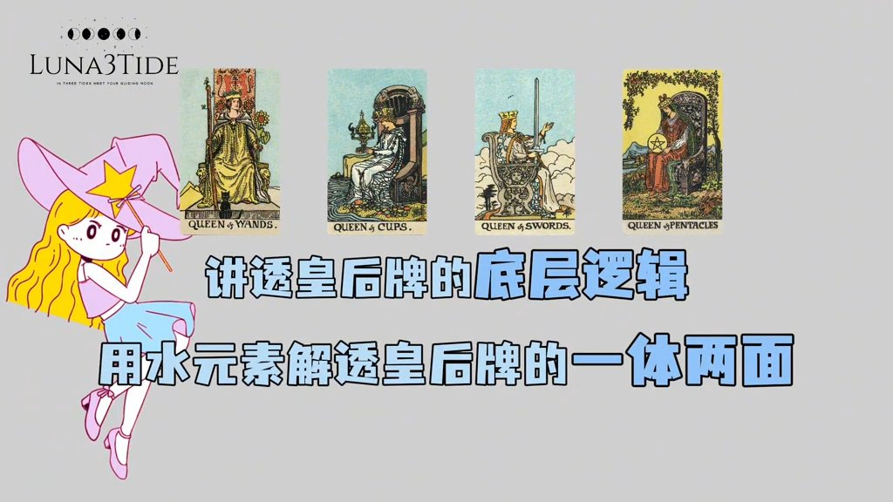
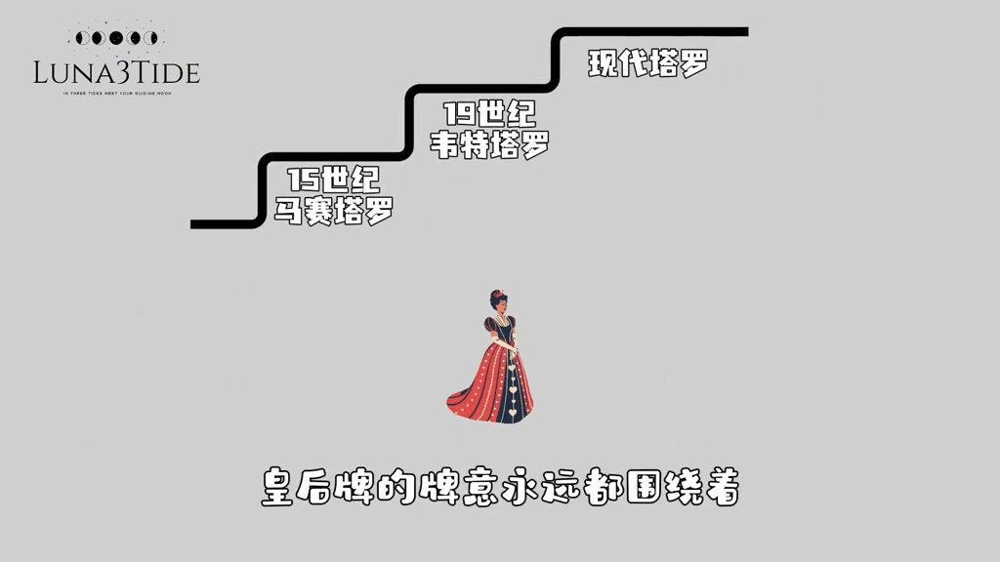
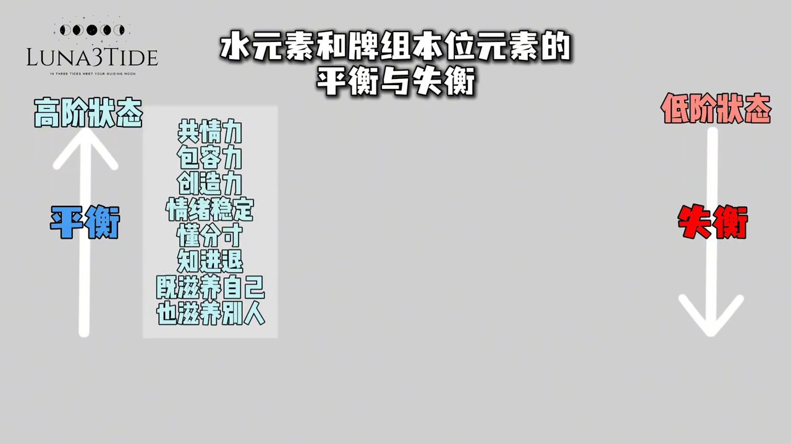
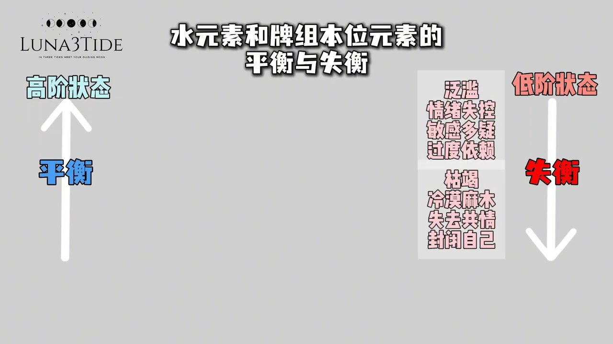
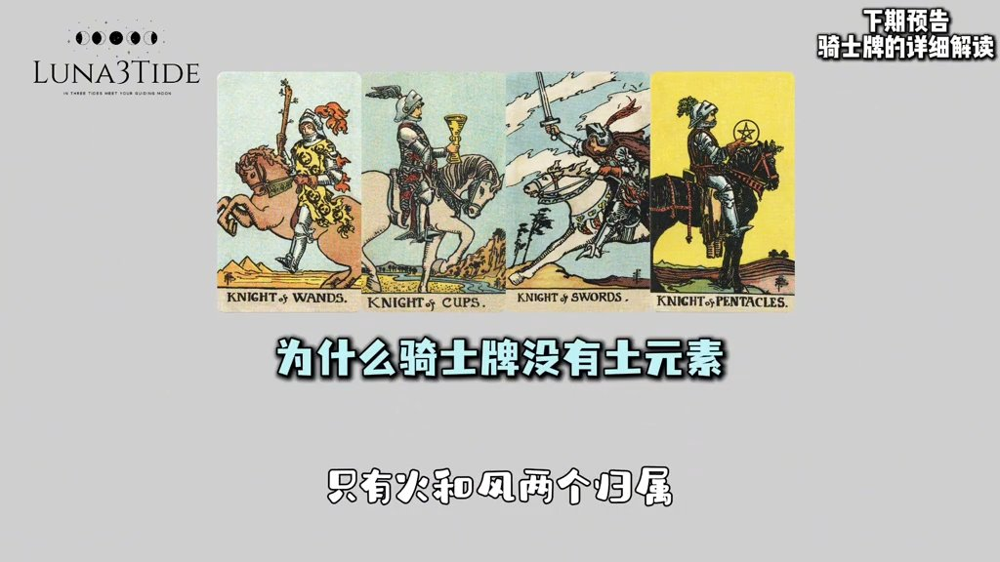

# 为什么塔罗所有皇后都是叠加水元素？讲透宫廷牌原型

> 整理来源：Luna3Tide 抖音视频 | 字幕来源：Whisper large-v3-turbo
>
> **学习重点**：皇后牌永远对应水元素是跨体系的铁则，理解水元素的平衡与失衡，是解读所有皇后牌的核心钥匙。

---

## 皇后牌与水元素：跨体系的铁则

**核心要点**：无论韦特、马赛还是透特塔罗，皇后牌永远绑定水元素，这是整个塔罗体系中唯一没有任何争议的对应关系。

这个铁则的成立，有三个底层逻辑，从根源上就定死了。

**第一，宫廷原型的本质。** 不管是东方还是西方，皇后的世俗原型都是女性的滋养、包容、孕育与共情。而水元素的核心本质正是情绪、感受、共情、滋养与创造力——与皇后的原型百分百契合，没有任何其他元素能够替代。

**第二，四元素的阴阳属性。** 塔罗里，火和风是阳性元素，水和土是阴性元素，而皇后是极致的阴性能量。土元素虽然也是阴性，但它的核心是固化、落地、积累；皇后的核心是流动的、包容的、充满生命力的，只有水元素的流动属性，能完美匹配皇后的阴性能量。

**第三，全体系的牌义传承。** 从15世纪最古老的马赛塔罗，到19世纪的韦特塔罗，再到现代所有的塔罗体系，皇后牌的牌义始终围绕着情感、共情、滋养、创造力与包容展开，而这些全部都是水元素的核心关键词。百年传承下来，没有任何体系推翻过这个对应。

---

## 水元素的一体两面：解读所有皇后牌的核心框架

**核心要点**：解读皇后牌，关键是看水元素与牌组本位元素之间的平衡与失衡，这就是皇后牌的"一体两面"。

懂了"皇后等于水元素"这个核心，解牌就不会再出错。具体来说，要看水元素与该组本位元素之间的动态关系。

**当水元素平衡时，是皇后牌的高阶状态。** 不管是哪一组的皇后，都拥有极致的共情力、包容力与创造力，情绪稳定，懂得分寸的进退，既能滋养自己，也能滋养别人。举个例子：圣杯皇后是纯水元素，平衡时就是极致的疗愈者；宝剑皇后是风加水，平衡时就是智商情商双高，既能一针见血解决问题，也能照顾别人的情绪。

**当水元素失衡时，是皇后牌的低阶状态。** 失衡分两种走向：要么是水的泛滥——情绪失控、敏感多疑、过度依赖；要么是水的枯竭——冷漠麻木、失去共情力、封闭自己。比如权杖皇后水元素失衡，可能变得骄纵任性、情绪不稳定；钱币皇后水元素失衡，则可能变得贪慕虚荣、唯利是图。

---

## 总结

**核心要点**：抓住"水元素的平衡与失衡"这一核心，解读任何皇后牌都不会出错。

皇后牌的本质就是水元素。平衡，就是高阶的滋养与包容；失衡，就是低阶的情绪内耗与失控。抓准这个核心，解牌时永远不会走偏。

下一期将讲解骑士牌：为什么骑士牌只有火和风两个归属，永远没有土元素？
