# 最实用的经典牌阵·19世纪马蹄铁牌阵详解

> 整理来源：Luna3Tide 抖音视频 | 字幕来源：Whisper large-v3
>
> **学习重点**：系统讲解19世纪欧美职业塔罗圈流传百年的马蹄铁牌阵七个牌位的精准定义与解读边界，并通过完整感情咨询案例演示从因果溯源到结果预判的闭环逻辑。

---

## 为什么要学马蹄铁牌阵

**核心要点**：马蹄铁牌阵形成了从因果溯源到风险预判、再到决策落地、结果推演的完整逻辑闭环，是职业级塔罗师的核心工具。

很多同学学了很多复杂的牌阵，在实际运用时却总是用不好——要么解读非常流水账，客户听了没感觉；要么牌位越解越乱，隐藏影响和阻碍分不清楚；要么给不出落地建议，客户问两句就卡壳。甚至同一个牌阵，十个老师能讲出十个版本，到底哪个才是真正能用、管用的？

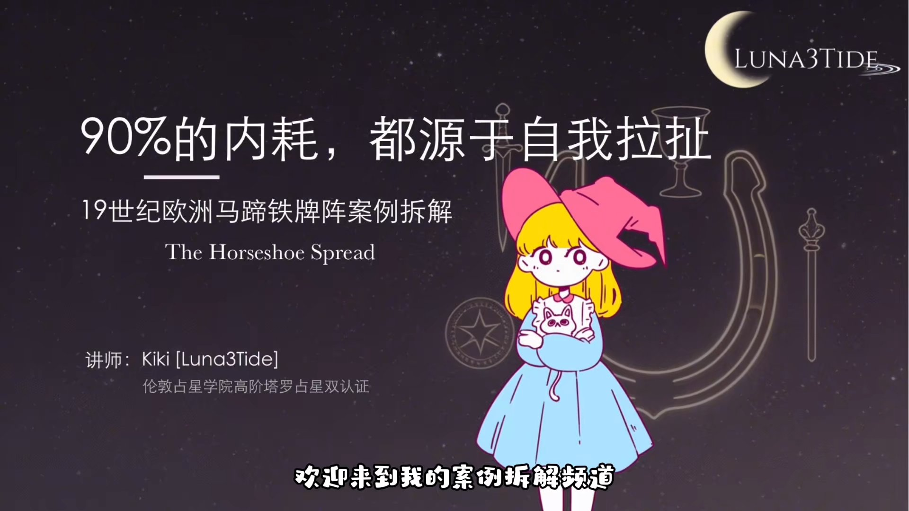

今天带来的是19世纪经典马蹄铁牌阵。这个牌阵源自19世纪欧洲大陆，是欧美职业塔罗圈流传百年、形成完整闭环咨询逻辑的标准版。它的七个位置不是随便排列的，形成了一个完美的逻辑链：你用这个牌阵不需要额外补排，就可以把一个问题的前因后果、明线暗线全部拆解清楚。咨询者听完只会觉得你说到了他的心坎里，给出的建议也能用、管用。

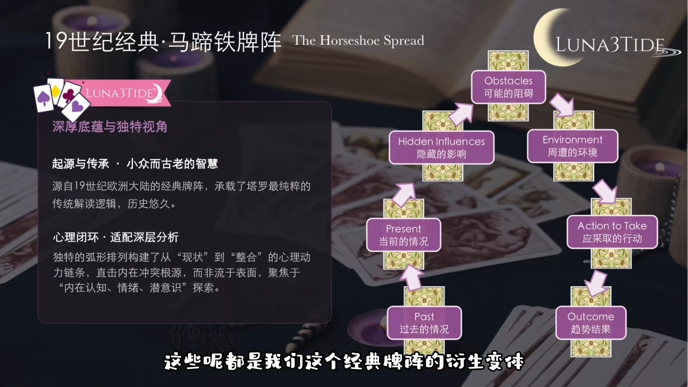

需要特别说明的是，市面上有很多在经典牌阵基础上做了变形的版本，要么打乱了排位顺序，要么砍掉了核心位置，看似简单好上手，但新手用起来只会越解越乱。拿到任何牌阵之后，要先去找排位与排位之间的逻辑，而不是机械地按照一二三四五的顺序去解读。

---

## 七个牌位的精准定义与解读边界

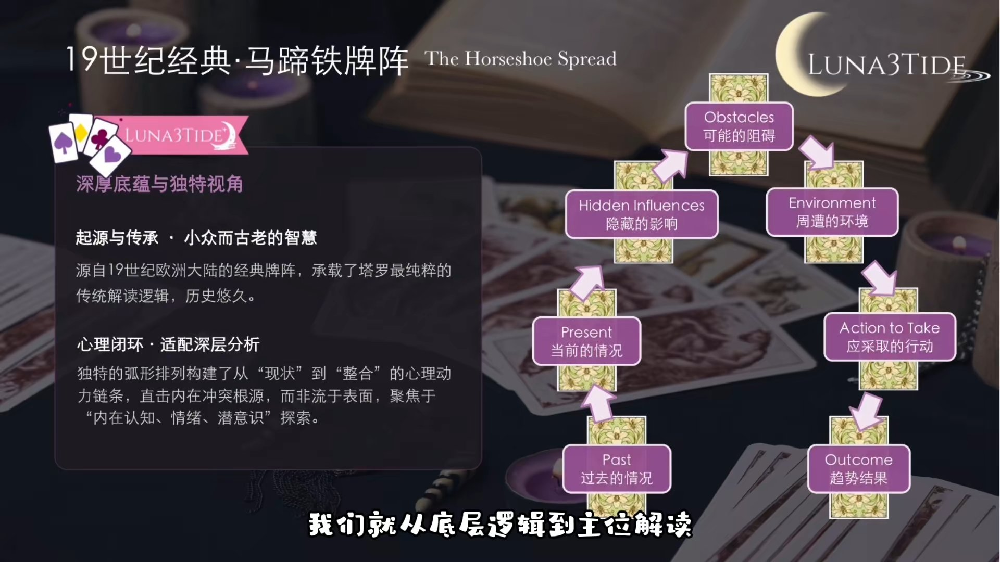

**核心要点**：每个牌位都有严格的解读边界，只有把边界搞清楚，才不会出现解读混乱、逻辑断层的情况——这也是职业塔罗师与新手最核心的区别。

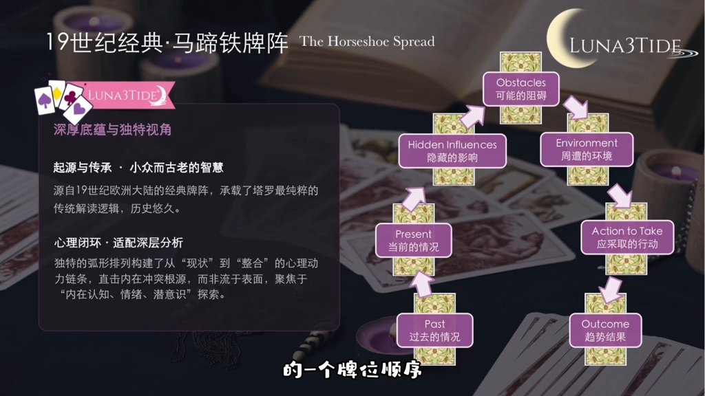

标准版马蹄铁牌阵的排位顺序是固定不变的：一号位（过去）→ 二号位（现在）→ 三号位（隐藏影响）→ 四号位（可能的阻碍）→ 五号位（周遭环境）→ 六号位（应采取的行动）→ 七号位（趋势结果）。这个顺序是一条完整的线性逻辑链，就像带着咨询者走了一遍他的问题：先看他是怎么走到今天的，再看他现在站在哪里，再看他没有看到的暗线，再看他前面会遇到的坑，再看周围的环境是帮他还是拖他后腿，然后告诉他该怎么走，最后告诉他按照当前轨迹走下去会到哪里。整体没有任何跳跃，也没有任何逻辑漏洞。

### 一号位：过去的情况

**核心要点**：一号位不是泛泛的"过去发生的事"，而是直接导致影响当下现状的核心过往因果——当下问题的根源。

很多人对这个牌位的理解就是"过去发生的事"，然后开始泛泛地解牌，比如抽到圣杯就说"你过去离开了一段关系"，这完全浪费了这个牌位的价值。这个牌位有两个核心重点：第一，必须是直接影响当下现状的事；第二，必须是当下问题的根源。

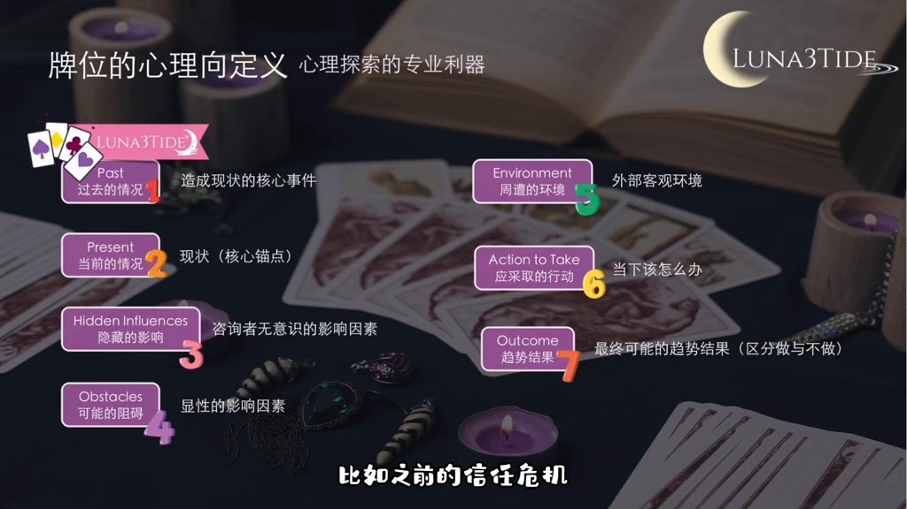

举个例子：假如咨询者问要不要和现在男友分手，当下的状况是两个人天天吵架冷战，那一号位的"过去"不是"你三年前谈过一段失败恋爱"，而是你们这段关系里之前发生过的、直接导致现在冷战吵架的核心事件，比如之前的信任危机、三观不合的爆发、付出不对等的长期积累——这些才是一号位要挖的东西。

这里有一个小技巧：这个位置永远要和二号位的"现在"做联动。解读完一号位，必须能回答一个问题：这件事是怎么影响到现在的？如果关联不上来，就要重新好好再想一下。

### 二号位：当前的情况

**核心要点**：二号位是整个牌阵的锚点，所有其他位置都要围绕它展开，必须同时读出客观状态和主观心理状态，给咨询者"你说到我了"的精准感。

这个牌位是整个牌阵的锚点，剩下所有位置都要围绕着它来展开。它说的是咨询者当下所处的真实处境、核心心态，以及对问题的真实认知——既包括明面上的客观状态，也包括当下的主观心理状态。

很多人读这个牌位只看客观情况，不看主观心态。塔罗咨询的本质是心理加趋势的双重解读，只有读懂了当下的心态，才能知道他为什么会陷入这个困境，同时才能听懂他没说出口的话。举例来说，二号位抽到节制逆位，不是只说"你现在在这段关系里有所隐瞒"，还要解读出当下的心态：不敢坦诚，想靠小聪明蒙混过关，自己不想分手又不想解决问题——这才是最核心的处境。这个牌位必须要给咨询者"你说到我了"的感觉，它也是建立信任的核心，必须精准，不能泛泛而谈。

### 三号位：隐藏的影响

**核心要点**：三号位是整个牌阵的王炸，专门解读咨询者自身没有意识到的隐藏因素，绝对不能解读咨询者已经知道的事。

这个牌位是整个牌阵的王炸，也是拉开与其他塔罗师差距的关键，同时也是新手最容易读错的牌位。精准定义是：咨询者自身没有意识到的、隐藏在表面之下、正在影响事件走向的所有因素，包括他的潜意识动机、未被察觉的情绪模式、幕后的人和事、未暴露的真实想法、隐藏的助力或阻力。

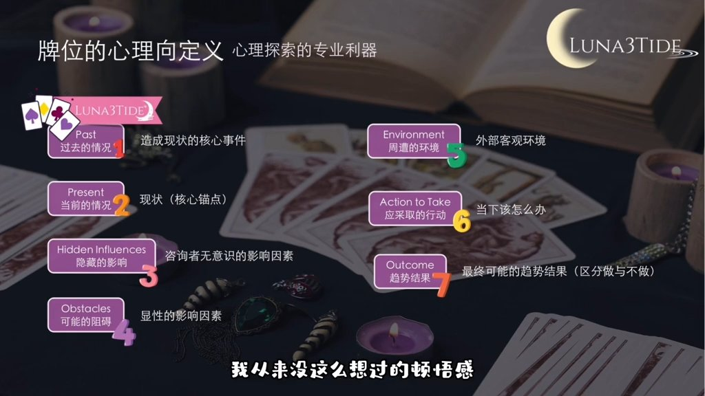

这里有一条绝对不能碰的红线：这个牌位绝对不能解读咨询者已经知道的事。很多人会把三号位和四号位的阻碍混淆，比如咨询者已经知道"妈妈不同意我们在一起"，你还在三号位读这个，那就完全错了。三号位是他不知道的、没有意识到的。

举个例子：咨询者说"我就是觉得他不爱我了，所以想分手"，三号位抽到月亮，要解读的不是"你们之间有隐瞒"，而是"你自己没意识到，你之所以这么想分手，不是他真的不爱你了，而是你骨子里的不安全感——你害怕被抛弃，所以先主动提分手来保护自己"，这个潜意识的模式才是真正影响关系的最强因素。读这个牌位需要帮咨询者"开灯"，把他没看到的角落照亮，他听完之后会有"原来如此，我从来没这么想过"的顿悟感，这才是读对了。

### 四号位：可能的阻碍

**核心要点**：四号位是可预见的、显性的阻碍，与三号位的"未知隐藏"严格区分——要帮咨询者排雷，具体说清楚前面有什么坑、大概率会在什么时候出现。

这个牌位和三号位的隐藏影响必须严格区分开。最简单的区分标准：三号位是未知的、隐藏的；四号位是可预见的、显性的、已经有苗头的、客观存在的阻碍——在事件发展过程中大概率会出现的显性障碍、挑战和风险，包括人为的阻碍、客观条件的限制、现实层面的困难，是咨询者大概率能看到或者已经有苗头的问题。

举例：问复合，四号位抽到节制逆位，阻碍就是"你们之前的争吵和矛盾没有真正解决，就算复合，也会因为同样的问题再次爆发"。问跳槽，四号位抽到星币五，阻碍就是"新工作的薪资待遇没有你想象的那么好，会有经济上的压力"。这个牌位是在帮咨询者排雷，要告诉他前面有什么坑、这个坑是什么样的、大概率会在什么时候出现，而不是只说"你会遇到阻碍"这种废话。

### 五号位：周遭的环境

**核心要点**：五号位决定解读有没有全局观，要跳出咨询者自身视角，给他一个上帝视角，明确区分外部助力和外部阻力。

这个牌位是很多新手最容易忽略、甚至读成废话的牌位，但它是决定解读有没有全局观的关键。精准定义是：围绕咨询者和这个问题的所有外部客观环境，包括但不限于家庭亲友、同事、行业环境、社会舆论、政策规则、第三方人物的态度和影响——是咨询者自身之外的所有能影响事件走向的外部因素。

很多人读这个牌位就说"你的周遭环境还不错"，这完全是废话。这个牌位要分清楚哪些是外部的助力、哪些是外部的阻力，以及这些外部因素会怎么影响事件的走向。举例：问创业，五号位抽到权杖三，周遭环境就是"你所在的行业现在处于上升期，有很好的发展机会，身边也有能够给你提供资源的朋友"，这是外部助力；如果抽到节制逆位，那就是"行业内卷严重，政策有收紧的趋势，身边还有人在背后给你使绊子"，这是外部阻力。这个牌位要跳出咨询者自身的视角，给他一个上帝视角，让他看到自己所处的整个环境，而不是只盯着自己那点情绪。

### 六号位：应采取的行动

**核心要点**：六号位是咨询者付费的核心价值所在，行动建议必须基于前面一到五号位的所有信息一一对应，可落地、可执行、有针对性，绝不能空泛。

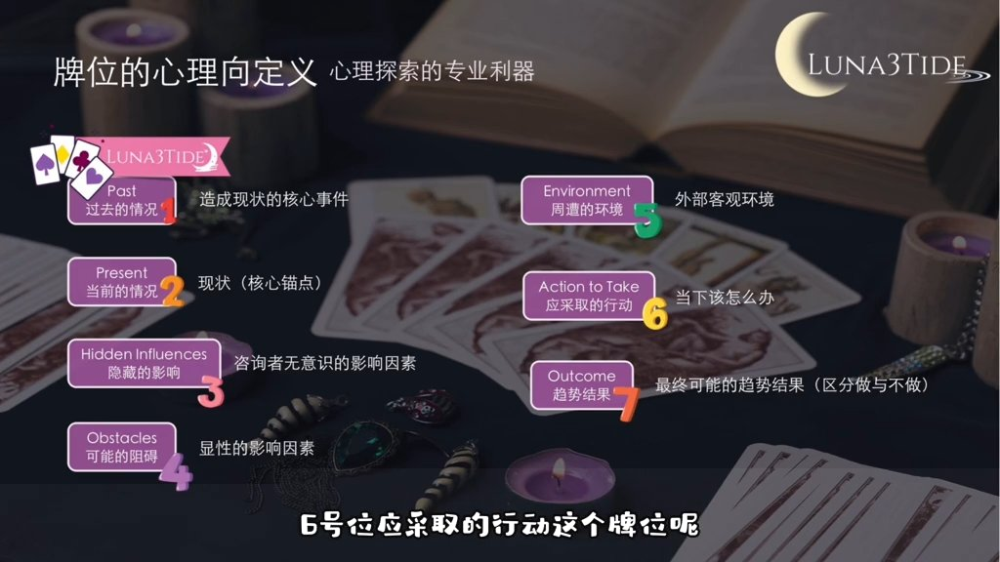

这个牌位是咨询者付费的核心——他花钱来不是听我们讲故事的，是来要解决方案的。这个牌位就是解决方案的核心：基于前面一到五号位的所有信息，给出最适配当前情况的、可落地可执行、风险最低的行动建议。绝对不能脱离前面的牌位空泛给建议。

这里有一个铁则：六号位的行动建议必须和前面一到五号位的信息一一对应——前面挖到了什么根源、预判了什么风险，你的行动建议就要针对这些来给。举一个反面例子：前面一号位看到了过去的信任危机，二号位看到了当下的冷战，三号位看到了咨询者的不安全感，四号位看到了沟通不畅的阻碍，五号位看到了亲友不看好的环境，结果六号位给的建议是"你要勇敢一点，主动找他沟通"——这就是废话，完全没有针对性。

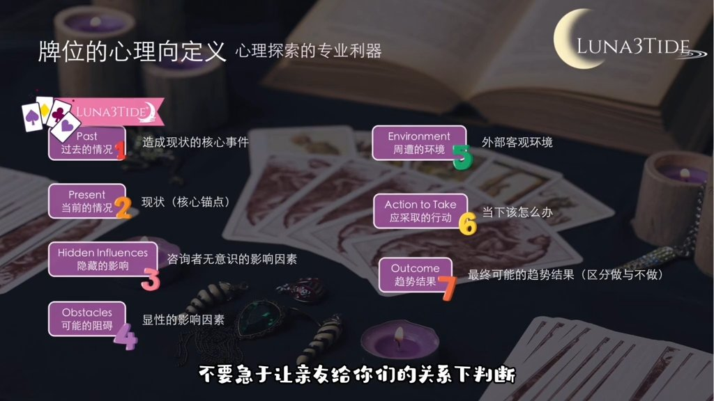

正确的解读应该是分三步：第一，先解决自己的问题，意识到现在的焦虑不是他不爱你，而是自己的不安全感在作祟，先稳住心态，不要带着情绪做决定；第二，主动找对方做一次深度坦诚的沟通，不要翻旧账，把心里的不安全感和对这段关系的期待清清楚楚地告诉他，同时也听听他的真实想法，把之前积累的矛盾根源解开；第三，不要急于让亲友给你们的关系下判断，先把两个人的问题解决好，再去面对外部的压力，避免外部的声音干扰判断。六号位的建议必须是可执行的，不能是空话；必须是适配的，不能脱离前面的牌位；必须是负责任的，不能给极端有风险的建议。

### 七号位：趋势结果

**核心要点**：七号位是当前轨迹下的大概率趋势，不是铁板钉钉的定数，必须与六号位的行动绑定，给咨询者方向感和主动权，而不是宿命论式的判决。

这也是很多新手容易翻车的牌位——把结果读成定数，然后翻车。这个牌位的精准定义是：基于当前咨询者的状态，在不改变当下行为模式、不采取六号位建议的前提下，事件自然发展的最大概率趋势结果。不是绝对的定数，是可以改变的。

塔罗的核心意义是趋吉避凶，不是宿命论。很多新手会说"你们肯定会分手""你肯定能升职"，这是非常不负责任的，一旦不对就会失去咨询者的信任。正确的解读方式是把结果和六号位的行动绑定：告诉咨询者，如果按照现在的状态继续下去不做任何改变，最终的趋势结果大概是什么；但如果采取了刚才说的行动建议，规避了前面的风险，解决了根源问题，这个结果是会往更好的方向发展的。这个牌位要给咨询者明确的方向，同时也要给他主动权，让他知道命运是掌握在自己手里的——我们不是来给他判死刑的，是来帮他趋吉避凶的。

---

## 完整案例拆解：暧昧三个月，能否顺利转正？

**核心要点**：通过七张牌的完整解读，展示马蹄铁牌阵如何将一个感情问题从根源到结果拆解得明明白白，每个牌位环环相扣，没有任何逻辑断层。

### 案例背景

咨询者是一位26岁的女生，和同公司的男同事暧昧了三个月。男生每天主动找她聊天，周末会约她吃饭看电影，肢体接触非常自然，但就是迟迟不表白、不捅破窗户纸。女生既害怕自己主动了会"掉价"，又害怕再耗下去浪费时间。最终来咨询的问题是：我和这个暧昧对象，到底能不能顺利转正，成为正式情侣？

抽到的七张牌：一号位（过去）逆位圣杯五 | 二号位（现在）正位宝剑二 | 三号位（隐藏影响）正位月亮 | 四号位（可能的阻碍）逆位权杖五 | 五号位（周遭环境）逆位星币三 | 六号位（应采取的行动）正位权杖一 | 七号位（趋势结果）逆位圣杯二

### 一号位：逆位圣杯五——过去的情感创伤

逆位圣杯五排在这个位置，指向的是这个女生在这段暧昧开始之前，刚从一段非常内耗的失败感情里走出来。上一段关系里，她可能一直处于被忽视、不被重视的位置，付出了很多却得不到同等的回应，最终带着很深的情感创伤和不安全感分开。

圣杯五逆位代表她表面上已经从过去的伤痛里走出来了，开始接受新的感情关系，但其实内心的阴影根本没有散。她害怕再次主动、再次付出、再次被辜负，所以在这段暧昧里从一开始就给自己设了防线，不敢往前迈出一步。这个过去的情感创伤，就是她今天陷入两难、不敢推进关系的核心根源——绝对不是一句"你过去感情不顺"这样简单的话能概括的。

### 二号位：正位宝剑二——当下的两难内耗

这张牌一出来，就精准戳中了女生当下的内耗。她现在就是宝剑二的状态：闭着眼睛、捂着耳朵，完全把自己困在了两难的内耗里。

客观上，她和男生的暧昧已经到了临界点，往前一步是转正，往后一步就是普通同事；但主观上，她既不敢主动捅破窗户纸（怕被拒绝、怕丢面子、怕再次受伤），同时又不甘心就这么不清不楚地耗下去（怕错过真心）。现在的状态完全就是自己把自己的眼睛蒙住了，既不敢看男生的真实心意，也不敢面对自己的真实需求，只能在原地内耗。当时解读到这里，咨询者的反馈就是"天哪，我就是这样"，信任感瞬间建立起来了。

### 三号位：正位月亮——两个隐藏的真相

月亮正位在这个位置，有两个核心的隐藏信息，都是女生自己完全没有意识到的。

第一，男生那边可能有隐藏的秘密——他对女生的主动，不是真心想和她发展成正式情侣，只是享受暧昧的感觉。第二，也是更深层的：女生自己的潜意识里，根本也不是真正想和这个男生在一起。她之所以沉迷这段暧昧，只是因为这个男生的主动和热情填补了她上一段感情里缺失的"被重视感"——她需要的不是这个男朋友，而是被人在意的感觉。这一点，她自己从头到尾都没有真正意识到。当时解读到这里，女生才反应过来说："难怪我总觉得哪里不对，原来我只是想找一个人填补空缺。"这就是三号位的核心价值。

### 四号位：逆位权杖五——三个可预见的阻碍

逆位权杖五在这个位置，精准对应了三个可预见的核心阻碍。

第一，两个人同属一家公司，办公室恋情的隐形规则就是最大的阻碍——一旦关系处理不好，不仅成不了情侣，还会影响两个人在公司的口碑和发展，甚至会被同事议论，这是明摆着的风险。第二，两个人之间的矛盾和不满一直被压抑着没有爆发，女生的不安全感、男生的不坦诚，现在看似风平浪静，一旦捅破窗户纸就会集中爆发，直接让这段关系崩盘。第三，女生本身的逃避型性格是最大的阻碍——遇到问题只会躲、只会内耗，不太敢正面沟通，就算有机会推进关系，也会因为害怕而退缩，这是完全可预见的风险。

### 五号位：逆位星币三——外部环境全是阻力

逆位星币三非常明确：这段关系的外部环境没有任何助力，全是阻力。两个人共同的同事估计不太看好这段关系；女生这边的朋友大概率也觉得这个男生不太靠谱，不太建议她继续推进；男生周围的亲朋好友，可能也没有把女生当成他正经想要交往的对象，完全没有任何撮合他们两个的助力。此外，公司的规章制度虽然没有明令禁止办公室恋情，但对同部门同事谈恋爱有隐性的限制，外部的规则环境也不支持这段关系的发展。

### 六号位：正位权杖一——三步行动建议

结合前面所有信息，给到女生的行动建议分三步。

第一步，停止内耗，主动发起沟通，打破当下的僵局。找一个私下的、非工作场合，和男生做一次坦诚的对话，直接问清楚他对这段关系的定位——到底是只想暧昧，还是发展成正式情侣。明确底线和需求，不要再猜来猜去。这是权杖一的核心：主动开创，打破僵局。

第二步，直面自己过去的情感创伤，分清楚你到底是喜欢这个人，还只是喜欢被人在意的感觉。先理清楚自己的真实需求，再决定要不要推进这段关系，不要带着过去的阴影进入新的关系，避免再次受伤。

第三步，一定要规避办公室恋情的风险。在两个人没有明确关系、达成共识之前，绝对不要在公司里公开你们的暧昧，不要把私人感情带到工作中，避免给两个人都带来职场上的负面影响。这也是提前规避四号位里的阻碍。

### 七号位：逆位圣杯二——两种结果，主动权在你

逆位圣杯二在这里分两种情况，完全和行动绑定，主动权交还给咨询者。

第一种情况：如果不采取任何行动，继续现在内耗逃避、猜来猜去，这段关系最终只会无疾而终。逆位的圣杯二代表这段关系从一开始就是不对等的，没有平等的沟通和坦诚的心意，男生会慢慢收回热情，最终两个人退回尴尬的普通同事关系，只会白白消耗掉自己的时间和情绪，甚至会再次加重对感情的创伤。

第二种情况：如果根据行动建议主动沟通、理清需求、规避风险，就会得到一个不再内耗的结果——要么男生坦诚自己的真实心意，愿意交往，你们顺利转正；要么你看清楚了他只是玩玩的态度，及时止损，快速抽离，避免自己陷得更深。无论哪种结果，女生都能掌握这段关系的主动权，不会再内耗。

---

## 总结：马蹄铁牌阵的核心价值

**核心要点**：马蹄铁牌阵的价值在于完整的逻辑闭环——每一个牌位都不是孤立的，都是环环相扣，只有把每个牌位的边界搞清楚、联动逻辑搞明白，才能真正用好这个牌阵。

这套马蹄铁牌阵没有任何逻辑断层：从因果溯源，到现状锚定，到暗线挖掘，到风险排雷，到全局研判，到行动落地，到结果预判，一套排下来，是把咨询者的问题拆得明明白白。他听完只会觉得：不仅能读懂他，还可以给他真正有用的解决方案。

大家一定要记住：马蹄铁的核心就是这个完整的逻辑闭环，每一个牌位都不是孤立的，都是环环相扣。只有把每个牌位的边界搞清楚、联动逻辑搞明白，才能真正用好这个牌阵。

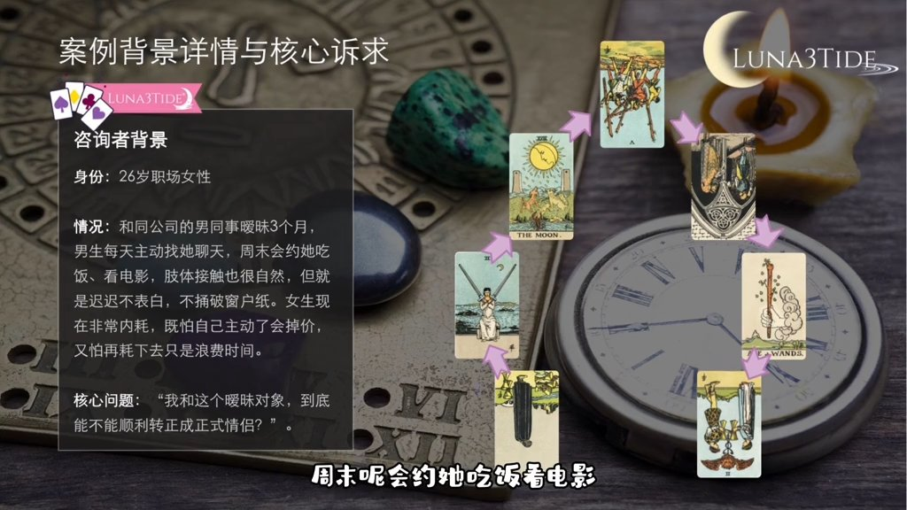

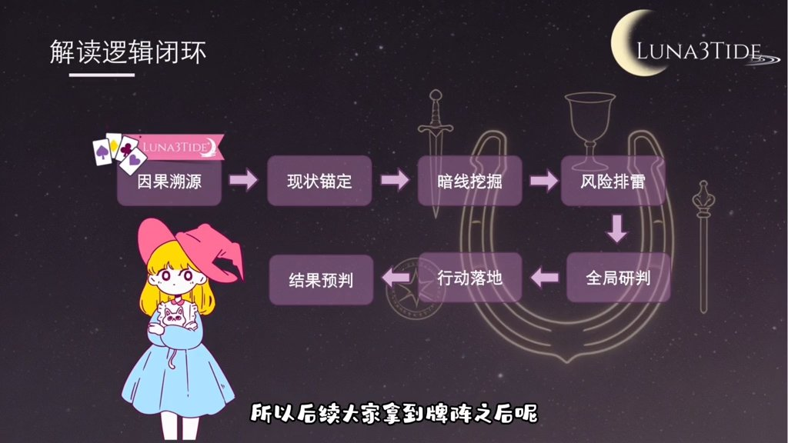

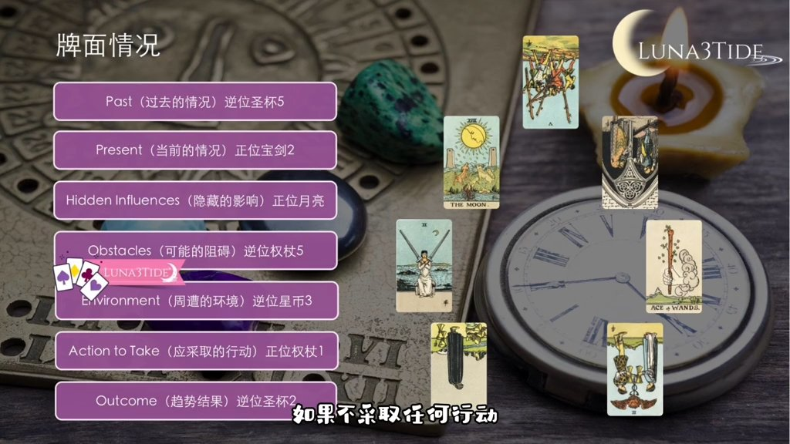

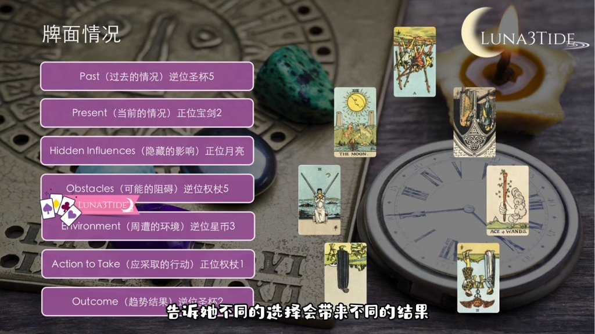

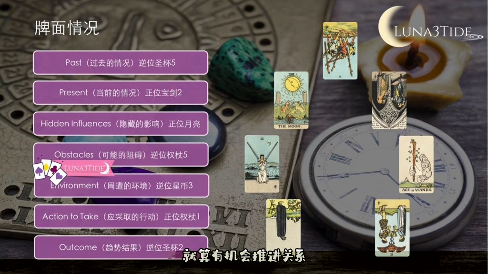

